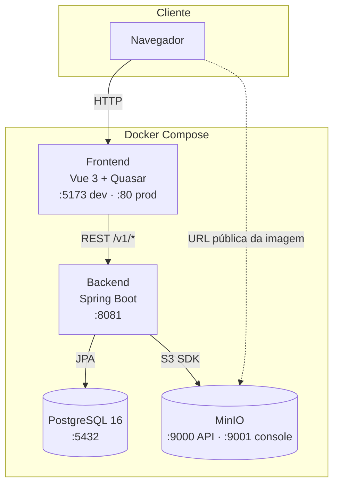
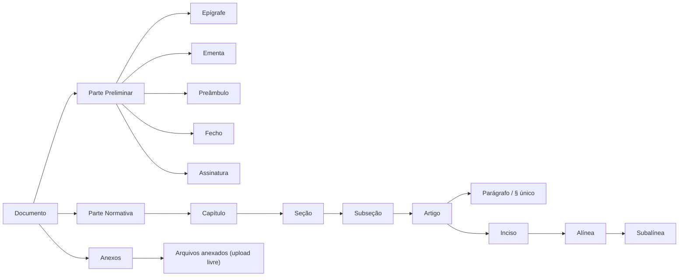
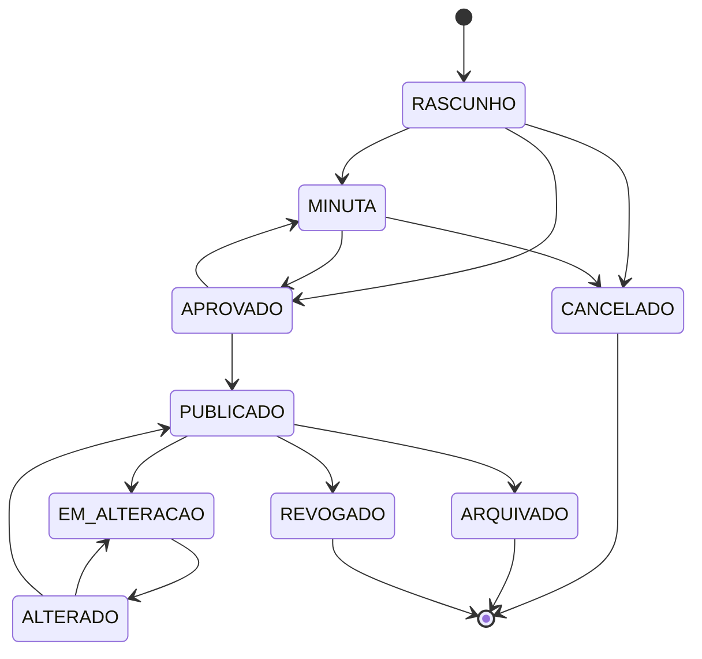

<div align="center">

# 📘 FAB Legis

**Sistema de elaboração, padronização e gestão de atos normativos do Comando da Aeronáutica**

*Do rascunho à publicação — com numeração automática, editor WYSIWYG e exportação em PDF/DOCX/HTML*


</div>

---

## 📑 Sumário

- [O que é o FAB Legis](#-o-que-é-o-fab-legis)
- [Principais funcionalidades](#-principais-funcionalidades)
- [Tecnologias](#-tecnologias)
- [Arquitetura do sistema](#-arquitetura-do-sistema)
- [Modelo de domínio](#-modelo-de-domínio)
- [Ciclo de vida do documento](#-ciclo-de-vida-do-documento)
- [Como executar](#-como-executar)
- [API REST](#-api-rest)
- [Estrutura de pastas](#-estrutura-de-pastas)
- [Perspectivas para o futuro](#-perspectivas-para-o-futuro)

---

## 🎯 O que é o FAB Legis

Elaborar um ato normativo no COMAER é um trabalho meticuloso: a numeração precisa
seguir a Espécie Normativa e o Assunto Básico corretos, a estrutura (Parte
Preliminar → Parte Normativa → Parte Final) obedece a regras rígidas de redação
legislativa, artigos e incisos devem ser renumerados a cada alteração, figuras
precisam de legenda sequencial e fonte, e o documento ainda tem de sair em PDF
com o brasão, as margens e a marca d'água certas para cada estágio de aprovação.

Hoje, boa parte disso é feita à mão em editores de texto genéricos — o que gera
retrabalho, inconsistência de formatação e erros de numeração que só aparecem na
revisão final.

**O FAB Legis resolve isso.** É uma plataforma web que trata o ato normativo não
como um arquivo de texto, mas como uma **estrutura de dados hierárquica**. Cada
capítulo, artigo, parágrafo, inciso e alínea é um nó em uma árvore. A partir daí,
o sistema consegue:

- 🔢 **numerar tudo automaticamente** — inclusive reordenando quando você move um artigo;
- 🧩 **impedir estruturas inválidas** — uma alínea não pode existir fora de um inciso;
- 👁️ **mostrar o documento final em tempo real**, lado a lado com o editor;
- 📤 **exportar o mesmo conteúdo** em PDF, DOCX e HTML sem reformatar nada;
- 🔍 **comparar versões** e mostrar exatamente o que mudou entre elas;
- 🚦 **controlar o ciclo de vida** (Rascunho → Minuta → Aprovado → Publicado…) com transições validadas no servidor.

> **Público-alvo:** seções de legislação, assessorias jurídicas e órgãos centrais
> de sistema responsáveis pela elaboração de ICA, NSCA, MCA, RCA, DCA, PCA, OCA,
> RICA, ROCA, TCA e FCA.

---

## ✨ Principais funcionalidades

### 📝 Editor estrutural WYSIWYG

O coração do sistema. Construído sobre **TipTap/ProseMirror**, apresenta três
painéis integrados:

| Painel | O que faz |
|---|---|
| **Sidebar (árvore)** | Navegação pela estrutura do documento via `q-tree` do Quasar, com ícones por tipo de elemento, indicador visual (⚠️ amarelo) de seções vazias e **dialog de metadados** (edição de título e número secundário diretamente na sidebar) |
| **Editor central** | Edição rica do elemento selecionado — negrito, itálico, sublinhado, alinhamento, cor, realce, tabelas e figuras |
| **Preview** | Renderização fiel do documento final, atualizada em tempo real, já com toda a numeração aplicada |

O conteúdo de cada elemento é armazenado no banco como **JSON TipTap** (formato
ProseMirror), garantindo fidelidade na serialização para XSL-FO (PDF) e HTML sem
depender de parsing de HTML.

Operações estruturais disponíveis: adicionar filho, adicionar irmão, **promover**
e **rebaixar** elementos na hierarquia (com validação de subárvore), mover para
cima/baixo, remover e reordenar por *drag and drop* (persistido no backend).

### 🔢 Numeração automática conforme a técnica legislativa

Segue o **Decreto nº 12.002/2024, art. 9º**:

| Elemento | Formato | Exemplo |
|---|---|---|
| Capítulo / Seção / Subseção | Romano | `CAPÍTULO IV` |
| Artigo | Ordinal até o 9º, cardinal a partir do 10 (com separador de milhar) | `Art. 3º` · `Art. 12.` · `Art. 1.024.` |
| Parágrafo | Ordinal/cardinal com `§` | `§ 1º` · `§ 10.` |
| Parágrafo único | Literal | `Parágrafo único` |
| Inciso | Romano | `VII` |
| Alínea | Letra minúscula | `c)` |
| Subalínea (item) | Arábico | `2.` |
| Artigo incluído por emenda | Sufixo de letra, permanente | `Art. 5-A` |

A renumeração é **recalculada a cada mutação da árvore** — inserir um artigo no
meio do documento reordena todos os subsequentes automaticamente, exceto os
incluídos por emenda (sufixo de letra, nunca renumerados — ver "Ciclo de
emenda"). ⚠️ Esse algoritmo hoje existe **em duas implementações mantidas
manualmente em paralelo** — `frontend/src/utils/numbering.js` (preview ao
vivo) e a classe interna `Numbering` de
`DocumentoFoBuilder.java` (fonte de verdade do PDF) — ver a discussão sobre
essa duplicação em "Perspectivas para o futuro".

### 🖼️ Figuras com numeração sequencial

Extensão TipTap customizada (`extensions/figure.js`) com *NodeView* em Vue:
upload da imagem para o MinIO, título, legenda e linha "Fonte:" embutida no HTML
para garantir portabilidade na exportação. A numeração ("Figura 1", "Figura 2"…)
usa CSS counters no preview web e é resolvida literalmente na exportação, de modo
que o mesmo HTML gera PDF e DOCX corretos. O sumário inclui automaticamente a
**Lista de Figuras**.

### 📄 Exportação de documentos

Geração de PDF **server-side** via **Apache FOP 2.10 / XSL-FO**, seguindo o
padrão da **NSCA 5-3**:

- margens A4 oficiais;
- cabeçalho com brasão da República (Portaria de Aprovação) e brasão da FAB (Capa);
- estrutura de três páginas: **Portaria de Aprovação → Capa → Sumário + Corpo normativo**;
- **sumário automático** com intervalos de artigos por capítulo/seção/subseção e hiperlinks internos;
- **marca d'água por status** — `RASCUNHO` e `MINUTA` em vermelho, `APROVADO` em verde;
- renderização de imagens embutidas via MinIO, tabelas e figuras.

O pipeline de geração é: conteúdo JSON TipTap → `XslFoContentRenderer` (serializa
inlines: negrito, itálico, cor, links, imagens) → `DocumentoFoBuilder` (monta o
XSL-FO completo) → Apache FOP → bytes PDF. Ao entrar em `APROVADO` ou
`ALTERADO`, o PDF é gerado e armazenado no MinIO (`urlPdf`) — a prévia embutida
na página de visualização usa essa cópia quando disponível. O botão **Baixar
PDF**, porém, sempre chama a geração ao vivo (`GET /{id}/pdf`), independente de
já existir uma cópia armazenada (ver discussão sobre cache na seção
"Perspectivas para o futuro").

### 🔍 Comparação de versões

Página dedicada (`ComparisonPage.vue`) alimentada pelo histórico real de
emendas (`EmendaHistorico`, agrupado por ciclo de publicação) — não por
snapshots do documento. Ver "Ciclo de emenda" e "Quadro de Justificativas"
acima para o detalhamento completo.

### 🔎 Visualização do documento

A `DocumentViewerPage` exibe o documento em modo leitura com quatro seções expansíveis:

| Seção | Conteúdo |
|---|---|
| **Informações do Documento** | Metadados (espécie, número, título, assunto, código, status) e linha do tempo de datas por status |
| **Visualização do Documento** | Iframe com o PDF armazenado (disponível a partir de `APROVADO`) ou mensagem de indisponibilidade; exibe `q-inner-loading` enquanto o PDF carrega |
| **Anexos** | Upload/listagem/remoção de arquivos vinculados ao documento (`AnexoController`), incluídos como páginas próprias na exportação em PDF |
| **Histórico de Versões** | Acesso direto à página de comparação de versões |

Ações disponíveis na topbar: baixar PDF (rascunho gerado sob demanda), clonar e
navegar para a comparação de versões.

### 🚦 Gestão do acervo

A `HomePage` oferece visão em tabela (ordenada por data de criação
decrescente por padrão) ou cards, filtros por espécie, situação e busca
textual, resumo quantitativo por situação e ações contextuais — editar
(Rascunho/Minuta/Em Alteração), clonar, comparar (habilitado só quando o
documento tem emendas registradas), exportar em PDF e transicionar de
situação. **Excluir** só aparece no menu de ações para documentos em
Rascunho ou Minuta — outras situações já são bloqueadas no backend
(`DocumentoService.delete()`), e a opção nem é oferecida na interface.

---

## 🛠️ Tecnologias

### Backend

| Tecnologia | Versão | Papel |
|---|---|---|
| **Java** | 25 | Linguagem |
| **Spring Boot** | 3.5.0 | Framework de aplicação |
| **Spring Data JPA / Hibernate** | — | Persistência e mapeamento objeto-relacional |
| **Spring Web (MVC)** | — | API REST |
| **Spring HATEOAS** | — | Links de navegação nos recursos |
| **PostgreSQL** | 16 | Banco de dados relacional |
| **MinIO SDK** | 8.5.12 | Armazenamento de objetos (imagens e PDFs) on-premise |
| **Apache FOP** | 2.10 | Geração de PDF server-side via XSL-FO |
| **Flyway** | — | Migrações de banco versionadas e auditáveis |
| **ModelMapper** | 3.2.0 | Conversão entidade ⇄ DTO |
| **Lombok** | 1.18.38 | Redução de boilerplate |
| **SpringDoc OpenAPI** | 2.6.0 | Documentação Swagger |
| **Maven** | Wrapper | Build |

### Frontend

| Tecnologia | Versão | Papel |
|---|---|---|
| **Vue** | 3.5 (Composition API) | Framework de UI |
| **Quasar** | 2.17 | Biblioteca de componentes e design system |
| **Vite** | 5.4 | Build tool e dev server com HMR |
| **Pinia** | 2.3 | Gerenciamento de estado |
| **Vue Router** | 4.5 | Roteamento SPA |
| **TipTap / ProseMirror** | 2.10 | Editor WYSIWYG estrutural |
| **diff** | 5.2 | Comparação textual entre versões |
| **vuedraggable** | 4.1 | Reordenação por drag and drop |
| **Sass** | — | Estilos e variáveis do Quasar |

### Infraestrutura

| Tecnologia | Papel |
|---|---|
| **Docker / Docker Compose** | Orquestração dos serviços |
| **Nginx** | Servidor estático do frontend em produção |
| **MinIO** | Object storage compatível com S3, 100% on-premise |
| **Multi-stage builds** | Imagens enxutas (JRE Alpine no backend, Nginx Alpine no frontend) |

---

## 🏗️ Arquitetura do sistema

### Visão geral dos serviços



### Camadas do backend — arquitetura em cebola

O backend adota uma separação clara em três camadas, com a dependência sempre
apontando para dentro (`infrastructure → application → domain`):

```
br.com.danielchipolesch
│
├── application/           ← Camada de aplicação (entrada/saída)
│   ├── controllers/       ← REST: Documento, EspecieNormativa, AssuntoBasico, Imagem
│   ├── dtos/              ← Contratos de request/response por agregado
│   └── helpers/           ← Montagem de EntityModel + links HATEOAS
│
├── domain/                ← Núcleo de negócio (sem dependência de framework web)
│   ├── entities/
│   │   ├── estruturaDocumento/   ← Documento, ItemPartePreliminar,
│   │   │                            ItemAnexoParteNormativa, ItemParteFinal,
│   │   │                            Anexo, EmendaHistorico + enums
│   │   └── numeracaoDocumento/   ← EspecieNormativa, AssuntoBasico
│   ├── services/          ← Regras de negócio (DocumentoService, DocumentoStatusService,
│   │                        DocumentoParteNormativaService, EmendaService,
│   │                        ImagemService, MapaAlteracaoPdfService…)
│   ├── builders/          ← DocumentoBuilder (construção fluente)
│   ├── util/tiptap/       ← TipTapNode + XslFoContentRenderer (JSON TipTap → XSL-FO)
│   ├── mappers/           ← Entidade ⇄ DTO
│   └── handlers/          ← GlobalExceptionHandler + exceções tipadas por domínio
│
└── infrastructure/        ← Detalhes técnicos
    ├── repositories/      ← Spring Data JPA
    ├── configurations/    ← Cors, Swagger, ModelMapper, Minio
    ├── enums/             ← Catálogos oficiais (espécies, assuntos, cabeçalho)
    └── runners/           ← Carga inicial das tabelas de referência
```

**Tratamento de erros centralizado:** um `GlobalExceptionHandler` converte
exceções de domínio (`ResourceNotFoundException`,
`StatusCannotBeUpdatedException`, `ResourceAlreadyExistsException`,
`InvalidInputException`, `ResourceCannotBeUpdatedException`) em respostas
padronizadas (`ExceptionDto`), com mensagens vindas de *enums* por agregado.

**Seed automático:** os `runners` (`EspecieNormativaRunner`,
`AssuntoBasicoRunner`) populam na inicialização as espécies normativas e os
assuntos básicos oficiais do COMAER, cada um com sua descrição normativa
completa — o catálogo já nasce pronto para uso.

### Camadas do frontend

```
frontend/src
│
├── pages/          ← HomePage · DocumentEditorPage · DocumentViewerPage · ComparisonPage
├── components/
│   ├── editor/     ← WysiwygEditor, EditorSidebar (com dialog de metadados),
│   │                 DocumentPreview, NormTreeItem, FigureView
│   ├── comparison/ ← DiffViewer
│   └── common/     ← AppTopBar, StatusBadge, NewDocumentDialog
├── stores/         ← Pinia: documents (acervo) · editor (documento em edição)
├── api/            ← client (fetch tipado) + módulos por recurso
├── extensions/     ← Figure (nó customizado do TipTap)
├── utils/          ← numbering (regras legislativas)
├── services/       ← pdfService (geração e download de PDF server-side)
└── router/         ← Rotas SPA
```

**Estado com Pinia — dois stores complementares:**

- **`documents`** — o acervo. Busca, cria, clona, salva e transiciona documentos;
  gera o *template* inicial de seções ao criar um novo ato.
- **`editor`** — o documento aberto. Mantém uma cópia profunda para edição
  isolada, controla o elemento selecionado, o flag `isDirty` (salvamento
  automático) e todas as operações de árvore, disparando a renumeração após cada
  mutação.

**Camada de API desacoplada:** o `client.js` encapsula `fetch` com verbos
tipados (`get`/`post`/`put`/`patch`/`del`); os módulos por recurso fazem a
**tradução entre a nomenclatura do backend e a do frontend** (`SECAO` ⇄
`secao_normativa`, `PARAGRAFO_NUMERADO` ⇄ `paragrafo`, `ITEM` ⇄ `sub_alinea`),
de modo que uma mudança no contrato REST não vaza para os componentes.

**Build otimizado:** o Vite separa *chunks* por vendor (`vendor-vue`,
`vendor-quasar`, `vendor-tiptap`, `vendor-utils`, `vendor-dnd`) para maximizar o
cache do navegador; o `pdfmake` é importado dinamicamente e fica fora do bundle
inicial.

---

## 🗂️ Modelo de domínio

O ato normativo é decomposto em três partes, conforme a técnica legislativa:



### Numeração oficial do documento

A identificação de um ato — por exemplo **`ICA 5-3`** — é composta por:

| Componente | Origem | Exemplo |
|---|---|---|
| **Espécie Normativa** | `EspecieNormativaEnum` | `ICA` (Instrução do Comando da Aeronáutica) |
| **Assunto Básico** | `AssuntoBasicoEnum` | `5` (Publicações) |
| **Número Secundário** | Calculado pelo sistema | `3` |

O **número secundário é atribuído automaticamente** pelo
`DocumentoService.calculateSecondaryNumber()`: o serviço busca todos os
documentos da mesma combinação Espécie + Assunto e **reaproveita a primeira
lacuna** na sequência, evitando buracos na numeração do acervo.

O catálogo de espécies inclui DCA, FCA, ICA, MCA, NSCA, OCA, PCA, RCA, RICA,
ROCA e TCA — cada uma com nome e descrição normativa completa. Os assuntos
básicos cobrem toda a tabela oficial (Doutrina Aeroespacial, Publicações,
Tecnologia da Informação, Pessoal, Ensino, Governança, Projetos e demais).

---

## 🚦 Ciclo de vida do documento

Transições validadas no servidor por `DocumentoStatusService.changeStatus()` —
tentativas inválidas resultam em `StatusCannotBeUpdatedException`:



**Regra de imutabilidade:** o conteúdo textual só pode ser alterado enquanto o
documento estiver em `RASCUNHO`, `MINUTA` ou `EM_ALTERACAO`. A partir de
`APROVADO`/`PUBLICADO`, qualquer tentativa de edição direta é rejeitada — para
alterar um ato já publicado, o documento entra em **ciclo de emenda**
(`PUBLICADO → EM_ALTERACAO → ALTERADO → PUBLICADO`, ver seção seguinte); para
criar uma revisão totalmente nova, use a operação de **clonagem**, que gera um
novo documento em `RASCUNHO` com novo número secundário, preservando o
original como registro histórico.

### ✍️ Ciclo de emenda — alterando um ato já publicado

Um ato normativo publicado não é reescrito livremente: a LC 95/1998 exige que
alterações a um dispositivo já em vigor apareçam com a redação anterior
riscada ao lado da nova, cada uma com sua própria cláusula de referência
("*incluído pela Portaria X, publicada no BCA Y*"). O FAB Legis modela isso
como um ciclo em cima do próprio elemento (artigo, parágrafo, inciso…), não
do documento inteiro:

1. O documento vai a `EM_ALTERACAO` (a partir de `PUBLICADO`).
2. Cada elemento tocado recebe uma ação — `INCLUIR`, `ALTERAR`, `REVOGAR` ou
   `DESFAZER` (desiste da edição pendente) — via
   `PATCH /v1/documentos/{id}/emendar/{secao}/{elementoId}`. O `ElementoEmendaStatusEnum`
   (`INALTERADO · INCLUIDO · ALTERADO · REVOGADO`) e o texto anterior ficam
   guardados no próprio registro do elemento; nada é sobrescrito.
3. O documento avança para `ALTERADO` e, na republicação (`ALTERADO → PUBLICADO`,
   com nova Portaria/BCA), `EmendaService.consolidarPublicacao()` **congela** a
   cláusula de cada elemento alterado — ela deixa de ser recalculada e passa a
   valer para sempre, mesmo que o documento entre em um novo ciclo depois.
4. Uma nova emenda sobre um elemento **já publicado** promove a redação vigente
   e reinicia o ciclo para aquele elemento — o texto anterior a essa nova
   emenda também fica registrado (`clausulaEmendaAnterior`), aparecendo riscado
   ao lado da cláusula que o descreveu originalmente.
5. Artigos incluídos por emenda recebem sufixo de letra (`Art. 5-A`) e **nunca**
   voltam a consumir numeração sequencial simples, mesmo depois de alterados ou
   revogados — a marca `incluidoPorEmenda` é permanente e independente do
   status ao vivo do elemento, evitando a renumeração de todo o documento a
   cada novo ciclo (vedada pela técnica legislativa).

### 📋 Quadro de Justificativas das Modificações Propostas

A cada ciclo de emenda, o sistema monta automaticamente o **Anexo XXIV da
NSCA 5-3** — a tabela (referência · texto em vigor · texto proposto ·
justificativa) que a autoridade exige junto da nova redação antes de aprovar
a publicação. Fica disponível na página **Comparar Versões**
(`/documento/{id}/comparar`):

- o seletor de **ciclo** lista tanto a rodada em andamento (ainda não
  publicada, comparada contra o texto vigente) quanto todos os ciclos já
  publicados anteriormente, cada um com sua própria Portaria/BCA;
- cards de comparação lado a lado/unificado por elemento (`DiffViewer`, com
  destaque de palavras via `diff`), incluindo anexos com imagem;
- **exportação em PDF** (`POST /{id}/mapa-alteracao/pdf`) no mesmo motor
  Apache FOP/XSL-FO do documento oficial — A4 paisagem, texto excluído em
  vermelho, texto inserido em azul, abre em nova aba.

---

## 🚀 Como executar

### Pré-requisitos

- **Docker** e **Docker Compose** (caminho recomendado), ou
- **JDK 25** + **Node.js 22** + **PostgreSQL 16** para execução local.

### Opção 1 — Docker Compose (recomendado)

```bash
git clone https://github.com/danielchipolesch/fab-legis.git
cd fab-legis

# Sobe PostgreSQL, MinIO, backend e frontend (modo desenvolvimento com HMR)
docker compose up -d

# Acompanhar os logs
docker compose logs -f backend frontend
```

**Serviços disponíveis:**

| Serviço | URL | Credenciais |
|---|---|---|
| 🖥️ Frontend (dev) | http://localhost:5173 | — |
| ⚙️ Backend (API) | http://localhost:8081 | — |
| 📚 Swagger UI | http://localhost:8081/swagger-ui.html | — |
| 📋 OpenAPI JSON | http://localhost:8081/v1/fab-legis-api | — |
| 🗄️ PostgreSQL | `localhost:5432` | `postgres` / `123456` |
| 🪣 MinIO (console) | http://localhost:9001 | `minioadmin` / `minioadmin123` |

**Perfil de produção** (frontend compilado e servido por Nginx na porta 80):

```bash
docker compose --profile production up -d
```

### Opção 2 — execução local

<details>
<summary><b>Backend</b></summary>

```bash
# Suba apenas as dependências de infraestrutura
docker compose up -d postgres minio

cd backend
./mvnw spring-boot:run          # Linux/macOS
mvnw.cmd spring-boot:run        # Windows
```

A API sobe em `http://localhost:8081` com o perfil `dev` ativo.
</details>

<details>
<summary><b>Frontend</b></summary>

```bash
cd frontend
cp .env.example .env.local      # ajuste VITE_API_BASE_URL se necessário
npm install
npm run dev                     # http://localhost:5173
```

Scripts disponíveis:

| Comando | Descrição |
|---|---|
| `npm run dev` | Servidor de desenvolvimento com HMR |
| `npm run build` | Build de produção em `dist/` |
| `npm run preview` | Pré-visualização do build |
</details>

### Variáveis de ambiente

**Backend**

| Variável | Padrão | Descrição |
|---|---|---|
| `DB_HOST` / `DB_PORT` / `DB_NAME` | `localhost` / `5432` / `fab-legis-dev` | Conexão PostgreSQL |
| `SPRING_DATASOURCE_USERNAME` / `_PASSWORD` | `postgres` / `123456` | Credenciais do banco |
| `MINIO_ENDPOINT` | `http://localhost:9000` | Endpoint S3 do MinIO |
| `MINIO_ACCESS_KEY` / `MINIO_SECRET_KEY` | `minioadmin` / `minioadmin123` | Credenciais do MinIO |
| `MINIO_BUCKET` | `fab-legis-imagens` | Bucket das imagens |
| `MINIO_PUBLIC_URL` | `http://localhost:9000` | URL pública para servir as imagens |

**Frontend**

| Variável | Padrão | Descrição |
|---|---|---|
| `VITE_API_BASE_URL` | `http://localhost:8081/v1` | URL base da API |
| `VITE_APP_ENV` | `development` | Ambiente (`development` \| `staging` \| `production`) |

> ⚠️ **Atenção:** as credenciais acima são valores de desenvolvimento. Em
> produção, substitua todas por *secrets* gerenciados fora do repositório.

---

## 🔌 API REST

Documentação interativa completa em **`/swagger-ui.html`**. Resumo dos endpoints:

### Documentos — `/v1/documentos`

| Método | Rota | Descrição |
|---|---|---|
| `POST` | `/` | Cria documento (calcula o número secundário) |
| `POST` | `/{id}/clonar` | Clona o documento em novo `RASCUNHO` |
| `GET` | `/{id}` | Obtém documento com anexo textual + links HATEOAS |
| `GET` | `/obter-todos` | Lista paginada (DTO enxuto, sem os itens da árvore) |
| `GET` | `/filtrar` | Filtra por espécie normativa e assunto básico |
| `PUT` | `/{id}` | Atualiza metadados (somente Rascunho/Minuta) |
| `PATCH` | `/{id}/status` | Transição de status validada (aprovação, publicação, republicação com Portaria/BCA…) |
| `PUT` | `/{id}/secoes` | Salva a árvore completa de seções |
| `PUT` | `/{idDocumento}/adicionar-item-anexo-parte-textual` | Adiciona item à parte normativa |
| `GET` | `/{id}/pdf` | Gera o PDF oficial do documento sob demanda (Apache FOP) |
| `DELETE` | `/{id}` | Remove o documento e seus itens em cascata (somente Rascunho/Minuta) |

### Emendas — `/v1/documentos` (ciclo de alteração)

| Método | Rota | Descrição |
|---|---|---|
| `PATCH` | `/{docId}/emendar/{secao}/{elementoId}` | Aplica `ALTERAR` \| `REVOGAR` \| `DESFAZER` a um elemento (documento deve estar `EM_ALTERACAO`) |
| `POST` | `/{docId}/emendar/{secao}` | Inclui um novo elemento por emenda |
| `PATCH` | `/{docId}/emendar/{secao}/{elementoId}/reordenar` | Reordena um artigo incluído por emenda entre outros artigos incluídos ainda não publicados |
| `GET` | `/{id}/historico` | Histórico de transições de status do documento |
| `GET` | `/{id}/mapa-alteracao` | Quadro de Justificativas por ciclo (elemento atual + todos os já publicados) |
| `POST` | `/{id}/mapa-alteracao/pdf` | Exporta o quadro de um ciclo em PDF (A4 paisagem) |
| `GET` | `/com-historico-emenda` | IDs de documentos com pelo menos uma emenda registrada — usado para habilitar "Comparar versões" na home |

### Anexos — `/v1/documentos/{documentoId}/anexos`

| Método | Rota | Descrição |
|---|---|---|
| `GET` | `/` | Lista os anexos do documento |
| `POST` | `/` | Envia um arquivo (multipart) como anexo |
| `DELETE` | `/{anexoId}` | Remove um anexo |

### Espécies normativas — `/v1/especie-normativa`

`POST` · `GET /{id}` · `GET /obter-todos` · `PUT /{id}` · `DELETE /{id}`

### Assuntos básicos — `/v1/assunto-basico`

`POST` · `GET /{id}` · `GET /obter-por-codigo-assunto-basico/{code}` · `GET /obter-todos` · `PUT /{id}` · `DELETE /{id}`

### Imagens — `/v1/imagens`

| Método | Rota | Descrição |
|---|---|---|
| `POST` | `/upload` | Envia imagem (multipart, máx. 10 MB) para o MinIO e devolve a URL pública |

O `ImagemService` cria o bucket sob demanda na primeira execução e aplica
automaticamente a política de leitura pública, de modo que as URLs retornadas
possam ser referenciadas diretamente no HTML do documento.

---

## 📁 Estrutura de pastas

```
fab-legis/
├── docker-compose.yml          # Orquestração: postgres, minio, backend, frontend
├── backend/
│   ├── Dockerfile              # Multi-stage: Maven build → JRE Alpine
│   ├── pom.xml
│   └── src/main/
│       ├── java/br/com/danielchipolesch/
│       │   ├── application/    # Controllers, DTOs, helpers
│       │   ├── domain/         # Entidades, serviços, builders, mappers, exceções
│       │   └── infrastructure/ # Repositórios, configurações, enums, runners
│       └── resources/
│           ├── application*.properties
│           └── db/migration/   # Scripts SQL
└── frontend/
    ├── Dockerfile              # Multi-stage: base → development | build → Nginx
    ├── nginx.conf
    ├── vite.config.js
    ├── package.json
    ├── public/                 # Brasões, favicon
    └── src/                    # pages, components, stores, api, utils, extensions
```

---

## 🔭 Perspectivas para o futuro

O FAB Legis foi desenhado para crescer. As linhas de evolução abaixo estão
organizadas por horizonte e refletem o que a arquitetura atual já prepara.

### 🎯 Curto prazo — consolidar o núcleo

- **Autenticação e autorização** — integração com o diretório institucional
  (LDAP/Active Directory) via Spring Security, com perfis distintos para
  **Redator**, **Revisor**, **Aprovador** e **Publicador**, amarrando cada
  transição de status a uma competência real.
- **Versionamento por snapshot** — `EmendaHistorico` já registra o quê mudou em
  cada ciclo de emenda (texto anterior/novo, justificativa, ciclo de
  publicação), mas não guarda uma foto completa da árvore do documento em cada
  publicação; um snapshot imutável por ciclo daria ao `DiffViewer` comparações
  de estrutura inteira, não só por elemento.
- **Trilha de auditoria com identidade** — `EmendaHistorico` já registra o quê
  e quando; falta o **quem**, que depende da autenticação acima.
- **Flyway ativo** — migrações versionadas em `resources/db/migration` já em
  uso (atualmente em V8), com histórico rastreável de mudanças de esquema —
  da remoção de `FUNDAMENTACAO` (V1) ao rastreio de ciclo de emenda por
  publicação (V7/V8).
- **Cobertura de testes** — testes unitários dos serviços de domínio (com
  destaque para a numeração e as transições de status) e testes de integração
  dos controllers com Testcontainers.
- **Exportação DOCX nativa** — o HTML portável produzido pelo editor já foi
  pensado para isso; falta o conversor no backend.
- **Backend como fonte única da numeração/ordenação** — hoje `numbering.js`
  (frontend) e a classe `Numbering` de `DocumentoFoBuilder.java` (backend)
  implementam a mesma regra em paralelo, mantidas manualmente em sincronia; um
  endpoint que devolva a numeração já calculada eliminaria esse risco de
  divergência (ver opinião detalhada mais abaixo).
- **Cache do PDF gerado** — hoje todo PDF (documento oficial ou quadro de
  emendas) é renderizado do zero a cada download/exportação; avaliar
  armazenar o resultado no MinIO (documentos imutáveis) e/ou cache de curto
  prazo em Redis (rascunhos voláteis) para reduzir custo de CPU do FOP sob
  carga (ver opinião detalhada mais abaixo).

### 🚀 Médio prazo — fluxo de trabalho completo

- **Workflow de tramitação** — encaminhamento entre setores, fila de revisão,
  comentários em linha e aprovação eletrônica, transformando o sistema de editor
  em plataforma de processo.
- **Assinatura digital ICP-Brasil** — assinatura do PDF final com carimbo de
  tempo, conferindo validade jurídica ao documento publicado.
- **Edição colaborativa em tempo real** — o ProseMirror, base do TipTap, suporta
  nativamente CRDT/Y.js; múltiplos redatores no mesmo ato é uma evolução natural.
- **Busca full-text no acervo** — indexação do conteúdo dos artigos com
  PostgreSQL `tsvector` ou Elasticsearch, permitindo localizar dispositivos por
  texto e não apenas por metadados.
- **Grafo de referências normativas** — mapear quais atos alteram, revogam ou
  citam quais outros, e alertar automaticamente quando um ato referenciado for
  revogado.
- **Modelos (templates) por espécie** — estruturas pré-montadas de ICA, NSCA,
  MCA etc., reduzindo o esforço de partida de cada novo documento.
- **Importação de atos legados** — ingestão de documentos existentes em DOCX/PDF
  com reconhecimento automático da estrutura hierárquica.

### 🌐 Longo prazo — plataforma normativa

- **Portal público de consulta** — versão somente leitura do acervo publicado,
  com URLs permanentes por dispositivo (`/ica-5-3/art-12`), à semelhança do
  Planalto e do LexML.
- **Consolidação automática** — geração da versão vigente de um ato a partir da
  aplicação sucessiva de todas as suas alterações.
- **API pública e interoperabilidade** — adoção do padrão **LexML/Akoma Ntoso**
  para intercâmbio de atos normativos com outros órgãos da Administração.
- **Assistência por IA** — sugestão de redação conforme a técnica legislativa,
  detecção de ambiguidades e contradições, verificação de conformidade com a LC
  95/1998 e o Decreto 12.002/2024, e resumo automático de ementas.
- **Aplicativo móvel e modo offline** — consulta ao acervo publicado em campo,
  sem conectividade.
- **Painel analítico** — indicadores de tempo médio de tramitação, gargalos por
  setor, volume por espécie e assunto, apoiando a gestão da atividade normativa.
- **Alta disponibilidade** — implantação em Kubernetes com réplicas do backend,
  MinIO distribuído e PostgreSQL em cluster.

---

## 🤝 Contribuindo

O desenvolvimento ocorre na branch **`desenvolvimento`**. Ao contribuir:

1. Crie sua branch a partir de `desenvolvimento`;
2. Mantenha o padrão de camadas do backend e a separação de responsabilidades do frontend;
3. Escreva mensagens de commit descritivas em português;
4. Abra um Pull Request para `desenvolvimento`.

---

<div align="center">

**FAB Legis** — padronizando a atividade normativa do Comando da Aeronáutica.

</div>
