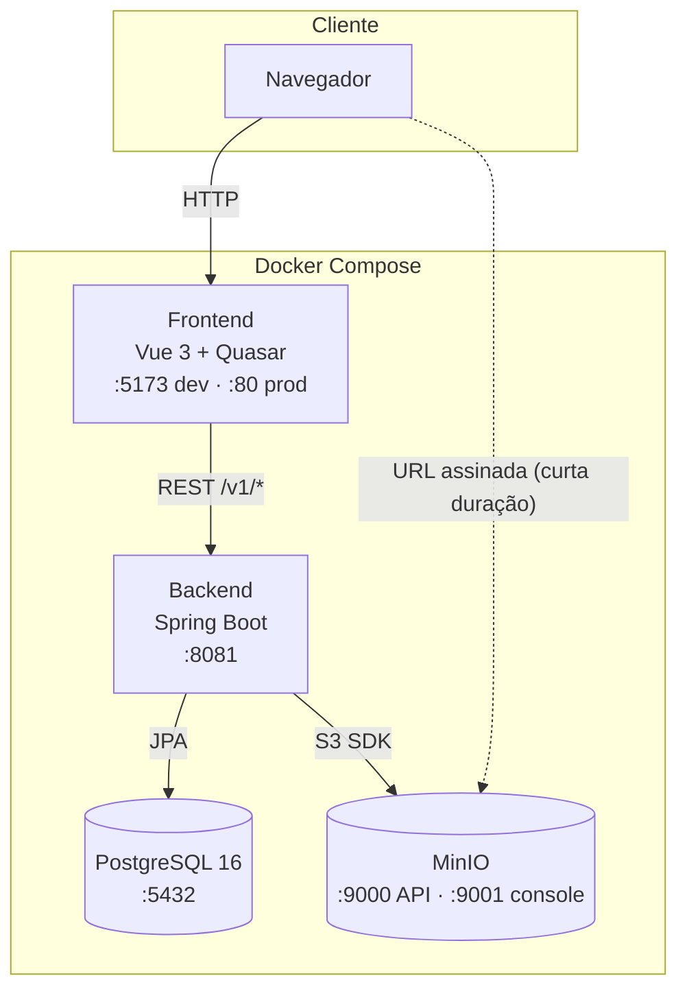

# Arquitetura

## Visão geral dos serviços



O bucket do MinIO é **privado** — o navegador nunca acessa um objeto direto pela URL "canônica" devolvida no upload. Toda leitura (imagem de figura, PDF do documento, PDF de portaria) passa antes por `POST /v1/imagens/urls-assinadas` (autenticado, igual ao resto do `/v1/**`), que troca a URL canônica por uma URL assinada (S3 pre-signed, válida por 1h) — só essa é usada como `src`/`href` no navegador. O backend, por sua vez, nunca depende de acesso público: lê os objetos direto via SDK autenticado (`ImagemService.getImageAsDataUri`/`getObjectStream`), usado por exemplo na geração do PDF oficial (Apache FOP embute a imagem como *data URI*, sem depender de rede).

## Camadas do backend — arquitetura em cebola

O backend adota uma separação clara em três camadas, com a dependência sempre apontando para dentro (`infrastructure → application → domain`):

```
br.com.danielchipolesch
│
├── application/           ← Camada de aplicação (entrada/saída)
│   ├── controllers/       ← REST: Documento, Emenda, Anexo, EspecieNormativa,
│   │                        AssuntoBasico, Imagem, Auth, Usuario,
│   │                        OrganizacaoMilitar, Auditoria, Notificacao
│   ├── dtos/              ← Contratos de request/response por agregado — records Java
│   ├── validation/        ← @CpfValido (Bean Validation customizada)
│   └── helpers/           ← Montagem de EntityModel + links HATEOAS
│
├── domain/                ← Núcleo de negócio (sem dependência de framework web)
│   ├── entities/
│   │   ├── estruturaDocumento/   ← Documento, ItemPartePreliminar,
│   │   │                            ItemAnexoParteNormativa, ItemParteFinal,
│   │   │                            Anexo, EmendaHistorico, DocumentoCompartilhamento,
│   │   │                            PortariaPublicacao + enums
│   │   ├── numeracaoDocumento/   ← EspecieNormativa, AssuntoBasico
│   │   ├── usuario/              ← Usuario, OrganizacaoMilitar, RefreshToken, PapelEnum
│   │   ├── auditoria/             ← LogAuditoria, AcaoAuditoriaEnum
│   │   └── notificacao/           ← Notificacao, TipoNotificacaoEnum
│   ├── services/          ← Regras de negócio (DocumentoService, DocumentoStatusService,
│   │                        DocumentoAcessoService, DocumentoConcorrenciaService,
│   │                        DocumentoParteNormativaService, EmendaService,
│   │                        PortariaPublicacaoService, UsuarioService,
│   │                        AuthService, RefreshTokenService, LogAuditoriaService,
│   │                        NotificacaoService, DocumentoPresencaService,
│   │                        ImagemService, DocumentoPdfService, MapaAlteracaoPdfService,
│   │                        FopFactoryProvider…)
│   ├── builders/          ← DocumentoBuilder (construção fluente)
│   ├── util/tiptap/       ← TipTapNode + XslFoContentRenderer (JSON TipTap → XSL-FO)
│   ├── mappers/           ← Entidade ⇄ DTO
│   └── handlers/          ← GlobalExceptionHandler + exceções tipadas por domínio
│
└── infrastructure/        ← Detalhes técnicos
    ├── repositories/      ← Spring Data JPA
    ├── security/          ← JwtService, JwtAuthenticationFilter, UsuarioPrincipal,
    │                        AutenticacaoUtil, DataSeeder (usuário admin padrão)
    ├── notificacao/       ← NotificacaoEmitterRegistry, DocumentoPresencaEmitterRegistry (SSE)
    ├── configurations/    ← Cors, Swagger, Security, Minio
    ├── enums/             ← Catálogos oficiais (espécies, assuntos, cabeçalho)
    └── runners/           ← Carga inicial das tabelas de referência
```

**Tratamento de erros centralizado:** um `GlobalExceptionHandler` converte exceções de domínio (`ResourceNotFoundException`, `StatusCannotBeUpdatedException`, `ResourceAlreadyExistsException`, `InvalidInputException`, `ResourceCannotBeUpdatedException`, `CredenciaisInvalidasException`, `ConflitoEdicaoException`, `AccessDeniedException` do Spring Security) em respostas JSON padronizadas — com `Content-Type` sempre explícito, mesmo quando a requisição original era um *stream* SSE, para nunca cair na negociação de conteúdo automática do Spring.

**Seed automático:** os `runners` (`EspecieNormativaRunner`, `AssuntoBasicoRunner`) populam na inicialização as espécies normativas e os assuntos básicos oficiais do COMAER, cada um com sua descrição normativa completa — o catálogo já nasce pronto para uso.

## Camadas do frontend

```
frontend/src
│
├── pages/          ← LoginPage · HomePage · DocumentEditorPage · DocumentViewerPage ·
│                      ComparisonPage · UsersPage · AuditoriaPage
├── components/
│   ├── editor/     ← WysiwygEditor, EditorSidebar (com dialog de metadados),
│   │                 DocumentPreview, NormTreeItem, FigureView,
│   │                 CompartilharDialog, Lc95HelpDialog
│   ├── comparison/ ← DiffViewer
│   └── common/     ← AppTopBar (menu de usuário, sino de notificações),
│                      StatusBadge, NewDocumentDialog
├── stores/         ← Pinia: auth (sessão) · documents (acervo) · editor (documento em edição)
├── api/            ← client (fetch tipado, com renovação automática de token) +
│                      módulos por recurso (documents, auth, usuarios, auditoria,
│                      notificacoes, referencias, portarias…)
├── extensions/     ← Figure (nó customizado do TipTap)
├── utils/          ← numbering (regras legislativas), cpf (validação/máscara),
│                      textoSugeridoPortaria (geração do texto sugerido da portaria)
├── services/       ← pdfService (geração e download de PDF server-side)
└── router/         ← Rotas SPA, com guarda de autenticação e de papel (admin/auditor)
```

**Estado com Pinia — três stores complementares:**

- **`auth`** — sessão. Guarda o access token e o usuário logado (persistidos em `localStorage`), expõe getters de papel (`isAdmin`/`isAprovador`/`isAuditor` — `isAuditor` depende exclusivamente do papel Auditor, independente de Admin) e o fluxo de renovação via refresh token, chamado automaticamente pelo `client.js` num 401.
- **`documents`** — o acervo. Busca, cria, clona, salva e transiciona documentos; gera o *template* inicial de seções ao criar um novo ato; também busca as portarias e o mapa de alteração de um documento.
- **`editor`** — o documento aberto. Mantém uma cópia profunda para edição isolada, controla o elemento selecionado, o flag `isDirty` (salvamento automático), a versão esperada para o bloqueio otimista e todas as operações de árvore, disparando a renumeração após cada mutação. `reload()` sempre busca a versão real no servidor (nunca do cache local) — importante após um `409` de conflito de edição.

**Camada de API desacoplada:** o `client.js` encapsula `fetch` com verbos tipados (`get`/`post`/`put`/`patch`/`del`), injeta o header `Authorization` via um *getter* plugado pelo `auth` store (evita import circular) e tenta renovar o token automaticamente uma vez antes de repassar um `401`; os módulos por recurso fazem a **tradução entre a nomenclatura do backend e a do frontend** (`SECAO` ⇄ `secao_normativa`, `PARAGRAFO_NUMERADO` ⇄ `paragrafo`, `ITEM` ⇄ `sub_alinea`), de modo que uma mudança no contrato REST não vaza para os componentes. Conexões SSE (notificações, presença) não passam pelo `client.js` — são `EventSource` nativas, com o token na *query string* (única forma de autenticar um `EventSource`, que não permite headers customizados). O `EventSource` reconecta automaticamente em caso de erro, mas hoje **sem nenhum handler ligado à store de autenticação** — se a sessão expirar, a conexão tenta reconectar silenciosamente em vez de forçar logout.

**Build otimizado:** o Vite separa *chunks* por vendor (`vendor-vue`, `vendor-quasar`, `vendor-tiptap`, `vendor-utils`, `vendor-dnd`) para maximizar o cache do navegador; o `pdfmake` é importado dinamicamente e fica fora do bundle inicial.

## Estrutura de pastas

```
fab-legis/
├── docker-compose.yml          # Orquestração: postgres, minio, backend, frontend, docs
├── mkdocs.yml                  # Configuração da documentação técnica (este site)
├── docs/                       # Fonte da documentação técnica (MkDocs Material)
│   ├── Dockerfile              # Multi-stage: mkdocs build → Nginx Alpine
│   └── nginx.conf
├── backend/
│   ├── Dockerfile              # Multi-stage: Maven build → JRE Alpine (+ Carlito)
│   ├── pom.xml
│   └── src/main/
│       ├── java/br/com/danielchipolesch/
│       │   ├── application/    # Controllers, DTOs, helpers
│       │   ├── domain/         # Entidades, serviços, builders, mappers, exceções
│       │   └── infrastructure/ # Repositórios, configurações, enums, runners
│       └── resources/
│           ├── application*.properties
│           ├── fop-config.xml  # Registro de fontes (Carlito como "Calibri") para o Apache FOP
│           └── db/migration/   # Scripts SQL versionados (Flyway)
└── frontend/
    ├── Dockerfile              # Multi-stage: base → development | build → Nginx
    ├── nginx.conf
    ├── vite.config.js
    ├── package.json
    ├── public/                 # Brasões, favicon
    └── src/                    # pages, components, stores, api, utils, extensions
```

**Migrações de banco:** versionadas em `resources/db/migration` (Flyway), estritamente aditivas — nunca se edita uma migração já aplicada. Atualmente em **V17**, com histórico rastreável de toda mudança de esquema: da remoção de `FUNDAMENTACAO` (V1) ao rastreio de ciclo de emenda por publicação (V7/V8), passando pela introdução de usuários/OM/papéis (V9), refresh token (V10), auditoria (V11), notificações (V12) e o registro histórico de portarias por documento (V17).
