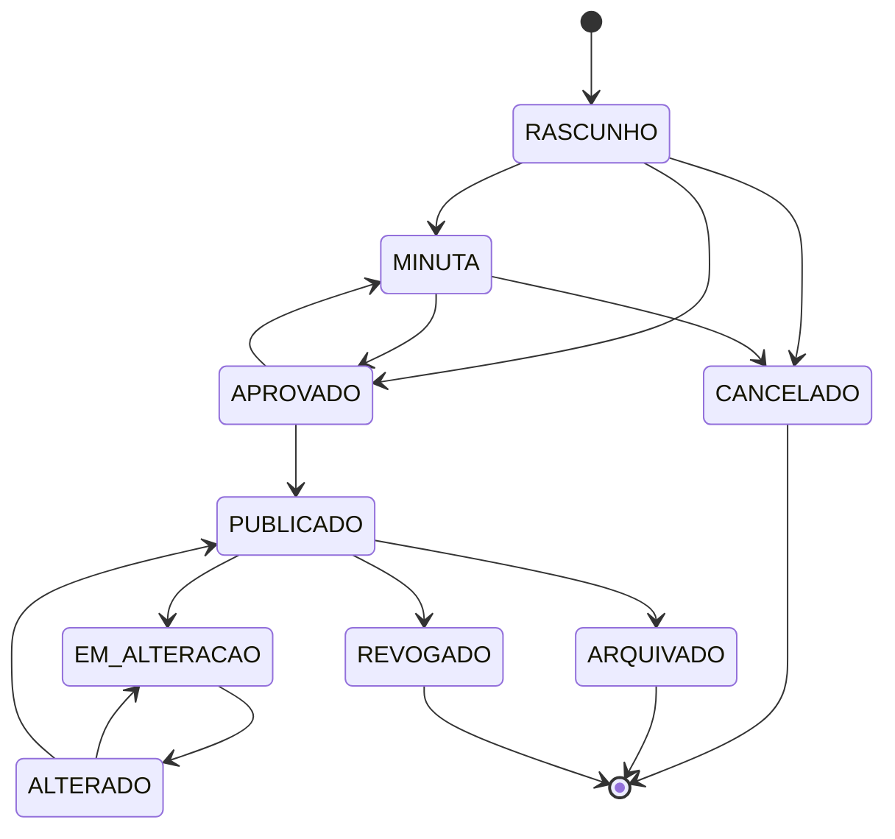

# Ciclo de Vida do Documento

Transições validadas no servidor por `DocumentoStatusService.changeStatus()` — tentativas inválidas resultam em `StatusCannotBeUpdatedException`:

**Quem pode disparar cada transição:** enviar para `MINUTA` ou `CANCELADO` é prerrogativa de quem já pode editar o documento (autor ou coautor — o próprio redator conduz o rascunho até pedir aprovação). As demais transições — `APROVADO`, `PUBLICADO`, `ALTERADO`, `EM_ALTERACAO`, `ARQUIVADO`, `REVOGADO` — exigem o papel **Aprovador** da mesma OM do documento, ou **Admin** (que aprova em qualquer OM). A checagem é centralizada em `DocumentoAcessoService.podeMudarStatus()`; tentativas sem o papel adequado retornam `403`, e o documento entrando em `MINUTA`/`EM_ALTERACAO` **notifica automaticamente todos os Aprovadores da OM** (ver [Autenticação e Colaboração](autenticacao.md)).

**Regra de imutabilidade:** o conteúdo textual só pode ser alterado enquanto o documento estiver em `RASCUNHO`, `MINUTA` ou `EM_ALTERACAO`. A partir de `APROVADO`/`PUBLICADO`, qualquer tentativa de edição direta é rejeitada — para alterar um ato já publicado, o documento entra em **ciclo de emenda** (`PUBLICADO → EM_ALTERACAO → ALTERADO → PUBLICADO`, ver seção seguinte); para criar uma revisão totalmente nova, use a operação de **clonagem**, que gera um novo documento em `RASCUNHO` com novo número secundário, preservando o original como registro histórico.

## Portaria, BCA e registro de publicações

Publicar (`APROVADO → PUBLICADO`), republicar após alteração (`ALTERADO → PUBLICADO`) e revogar (`PUBLICADO → REVOGADO`) todos exigem o registro de uma **Portaria** (órgão, setor, número, data) e de um **BCA** (número, data), além do upload do PDF da portaria correspondente. Esse registro é gravado como uma linha própria em `PortariaPublicacao`, nunca mesclado ao PDF do documento — cada portaria permanece um arquivo íntegro, condição necessária para uma futura assinatura digital (que cobre um intervalo de bytes exato do arquivo original; um merge invalidaria essa assinatura).

O tipo de cada registro é decidido automaticamente pelo status de origem:

| Transição | Tipo registrado (`TipoPortariaPublicacaoEnum`) | Numeração sequencial |
|---|---|---|
| `APROVADO → PUBLICADO` | `EDICAO` | Não (ocorre uma única vez) |
| `ALTERADO → PUBLICADO` | `ALTERACAO` | Sim — 1ª, 2ª, 3ª... calculado por `PortariaPublicacaoRepository.findMaxNumeroSequencialAlteracao()` |
| `PUBLICADO → REVOGADO` | `REVOGACAO` | Não (ocorre uma única vez) |

Todas as portarias registradas de um documento aparecem na tela de visualização, na seção **Portarias** (ver [Funcionalidades](funcionalidades.md#visualizacao-do-documento)), acessíveis via `GET /v1/documentos/{id}/portarias`.

**Revogar não republica o conteúdo:** ao contrário de publicar/republicar, a revogação exige apenas Portaria + BCA + PDF — **não** exige epígrafe, ementa, preâmbulo, fecho ou assinatura, já que revogar não altera o conteúdo do documento.

## Ciclo de emenda — alterando um ato já publicado

Um ato normativo publicado não é reescrito livremente: a LC 95/1998 exige que alterações a um dispositivo já em vigor apareçam com a redação anterior riscada ao lado da nova, cada uma com sua própria cláusula de referência ("*incluído pela Portaria X, publicada no BCA Y*"). O FAB Legis modela isso como um ciclo em cima do próprio elemento (artigo, parágrafo, inciso…), não do documento inteiro:

1. O documento vai a `EM_ALTERACAO` (a partir de `PUBLICADO`).
2. Cada elemento tocado recebe uma ação — `INCLUIR`, `ALTERAR`, `REVOGAR` ou `DESFAZER` (desiste da edição pendente) — via `PATCH /v1/documentos/{id}/emendar/{secao}/{elementoId}`. O `ElementoEmendaStatusEnum` (`INALTERADO · INCLUIDO · ALTERADO · REVOGADO`) e o texto anterior ficam guardados no próprio registro do elemento; nada é sobrescrito.
3. O documento avança para `ALTERADO` e, na republicação (`ALTERADO → PUBLICADO`, com nova Portaria/BCA — ver seção anterior), `EmendaService.consolidarPublicacao()` **congela** a cláusula de cada elemento alterado — ela deixa de ser recalculada e passa a valer para sempre, mesmo que o documento entre em um novo ciclo depois.
4. Uma nova emenda sobre um elemento **já publicado** promove a redação vigente e reinicia o ciclo para aquele elemento — o texto anterior a essa nova emenda também fica registrado (`clausulaEmendaAnterior`), aparecendo riscado ao lado da cláusula que o descreveu originalmente.
5. Artigos incluídos por emenda recebem sufixo de letra (`Art. 5-A`) e **nunca** voltam a consumir numeração sequencial simples, mesmo depois de alterados ou revogados — a marca `incluidoPorEmenda` é permanente e independente do status ao vivo do elemento, evitando a renumeração de todo o documento a cada novo ciclo (vedada pela técnica legislativa).

## Quadro de Justificativas das Modificações Propostas

A cada ciclo de emenda, o sistema monta automaticamente o **Anexo XXIV da NSCA 5-3** — a tabela (referência · texto em vigor · texto proposto · justificativa) que a autoridade exige junto da nova redação antes de aprovar a publicação. Fica disponível na página **Comparar Versões** (`/documento/{id}/comparar`):

- o seletor de **ciclo** lista tanto a rodada em andamento (ainda não publicada, comparada contra o texto vigente) quanto todos os ciclos já publicados anteriormente, cada um com sua própria Portaria/BCA;
- cards de comparação lado a lado/unificado por elemento (`DiffViewer`, com destaque de palavras via `diff`), incluindo anexos com imagem;
- **exportação em PDF** (`POST /{id}/mapa-alteracao/pdf`) no mesmo motor Apache FOP/XSL-FO do documento oficial — A4 paisagem, texto excluído em vermelho, texto inserido em azul, abre em nova aba;
- para o ciclo pendente atual, o botão **Texto Sugerido** gera um rascunho da própria redação da portaria de alteração (ver [Texto sugerido da portaria](exportacao-pdf.md#texto-sugerido-da-portaria-nsca-5-3-art-22)).
