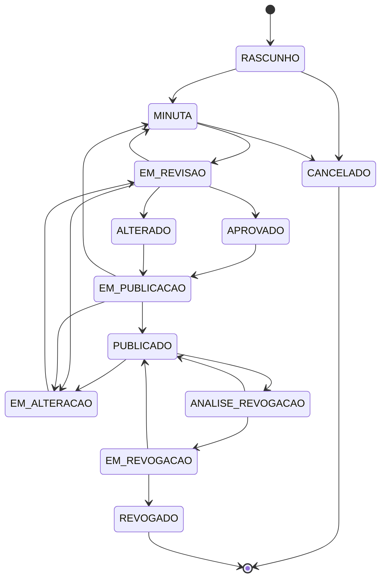

# Ciclo de Vida do Documento

Transições validadas no servidor por `DocumentoStatusService.changeStatus()` — tentativas inválidas resultam em `StatusCannotBeUpdatedException`:

`EM_REVISAO` e `EM_PUBLICACAO` são compartilhados pelas duas linhagens (fluxo normal e ciclo de emenda) — o destino final (`APROVADO` vs. `ALTERADO`, `EDICAO` vs. `ALTERACAO` na portaria) é decidido pelo mesmo discriminante em ambos os casos: se o documento já foi publicado alguma vez antes (`dtPublicacao != null`), é o ciclo de emenda; senão, é o fluxo normal.

**Atribuição pessoal, não papel genérico — cada transição tem um dono diferente:**

| Transição | Quem pode |
|---|---|
| `RASCUNHO/MINUTA → CANCELADO`, `→ MINUTA`, `→ EM_REVISAO`, `PUBLICADO → ANALISE_REVOGACAO` | Quem já pode editar o documento (autor/coautor com papel **Editor**) — inclui **escolher pessoalmente** quem vai revisar (`revisorId`, restrito a quem tem papel **Aprovador** na mesma OM) |
| `PUBLICADO → EM_ALTERACAO` | Qualquer **Aprovador** da mesma OM — única transição sem atribuição prévia (é uma iniciativa nova, não a continuação de uma fila) |
| A partir de `EM_REVISAO`/`ANALISE_REVOGACAO` (aprovar, aprovar revogação, devolver) | Só a pessoa atribuída como revisora daquele documento (`Documento.revisorAtribuido`) — ao aprovar, ela também escolhe pessoalmente quem vai publicar (`publicadorId`, papel **Publicador**), e o serviço já cascateia direto para `EM_PUBLICACAO` na mesma chamada |
| A partir de `EM_PUBLICACAO`/`EM_REVOGACAO` (publicar, revogar, devolver) | Só a pessoa atribuída como publicadora daquele documento (`Documento.publicadorAtribuido`) |

A checagem é centralizada em `DocumentoAcessoService.podeMudarStatus()`; tentativas sem a atribuição/papel adequado retornam `403`. Cada atribuição **notifica só a pessoa escolhida** (`NotificacaoService.notificarAtribuicao`), nunca uma OM inteira — ver [Autenticação e Colaboração](autenticacao.md). Devolver limpa a atribuição: a próxima vez que o documento for enviado, a pessoa pode ser outra.

**Editar durante a revisão:** o Aprovador atribuído pode editar o conteúdo do documento enquanto ele estiver em `EM_REVISAO` (`DocumentoAcessoService.podeEditar`/`DocumentoEditorPage.isReadonly` liberam isso especificamente para a pessoa atribuída). A partir de `EM_PUBLICACAO` em diante — incluindo todo o fluxo de revogação — ninguém mais edita o conteúdo, nem o autor original.

**Regra de imutabilidade:** fora isso, o conteúdo textual só pode ser alterado enquanto o documento estiver em `RASCUNHO`, `MINUTA` ou `EM_ALTERACAO`. A partir de `EM_REVISAO` (exceto pela pessoa atribuída, acima) em diante, qualquer tentativa de edição direta é rejeitada — para alterar um ato já publicado, o documento entra em **ciclo de emenda** (`PUBLICADO → EM_ALTERACAO → EM_REVISAO → ALTERADO → EM_PUBLICACAO → PUBLICADO`, ver seção seguinte); para criar uma revisão totalmente nova, use a operação de **clonagem**, que gera um novo documento em `RASCUNHO` com novo número secundário, preservando o original como registro histórico.

## Revogação em três etapas

Revogar um ato publicado segue o mesmo padrão de atribuição pessoal do fluxo normal, em vez de uma ação de um clique só: o Editor envia (`PUBLICADO → ANALISE_REVOGACAO`, escolhendo um Aprovador), o Aprovador atribuído analisa e aprova a revogação (`ANALISE_REVOGACAO → EM_REVOGACAO`, escolhendo um Publicador) ou devolve, e o Publicador atribuído formaliza (`EM_REVOGACAO → REVOGADO`, com Portaria/BCA — ver seção seguinte) ou devolve. Diferente do ciclo de emenda, a revogação não reabre o conteúdo do documento para edição em nenhuma etapa.

## Portaria, BCA e registro de publicações

Publicar e revogar, sempre a partir de `EM_PUBLICACAO`/`EM_REVOGACAO` (pela pessoa atribuída como publicadora), exigem o registro de uma **Portaria** (órgão, setor, número, data) e de um **BCA** (número, data), além do upload do PDF da portaria correspondente. Esse registro é gravado como uma linha própria em `PortariaPublicacao`, nunca mesclado ao PDF do documento — cada portaria permanece um arquivo íntegro, condição necessária para uma futura assinatura digital (que cobre um intervalo de bytes exato do arquivo original; um merge invalidaria essa assinatura).

O tipo de cada registro é decidido automaticamente por o documento já ter sido publicado antes ou não (`dtPublicacao != null` — o mesmo discriminante que decide `APROVADO` vs. `ALTERADO`, ver acima), não mais literalmente pelo status de origem do request (que agora é sempre `EM_PUBLICACAO`/`EM_REVOGACAO`):

| Publicando a partir de... | Tipo registrado (`TipoPortariaPublicacaoEnum`) | Numeração sequencial |
|---|---|---|
| Nunca publicado antes (1ª edição) | `EDICAO` | Não (ocorre uma única vez) |
| Já publicado antes (ciclo de emenda) | `ALTERACAO` | Sim — 1ª, 2ª, 3ª... calculado por `PortariaPublicacaoRepository.findMaxNumeroSequencialAlteracao()` |
| Revogando (`EM_REVOGACAO → REVOGADO`) | `REVOGACAO` | Não (ocorre uma única vez) |

Todas as portarias registradas de um documento aparecem na tela de visualização, na seção **Portarias** (ver [Funcionalidades](funcionalidades.md#visualizacao-do-documento)), acessíveis via `GET /v1/documentos/{id}/portarias`.

**Revogar não republica o conteúdo:** ao contrário de publicar/republicar, a revogação exige apenas Portaria + BCA + PDF — **não** exige epígrafe, ementa, preâmbulo, fecho ou assinatura, já que revogar não altera o conteúdo do documento.

## Ciclo de emenda — alterando um ato já publicado

Um ato normativo publicado não é reescrito livremente: a LC 95/1998 exige que alterações a um dispositivo já em vigor apareçam com a redação anterior riscada ao lado da nova, cada uma com sua própria cláusula de referência ("*incluído pela Portaria X, publicada no BCA Y*"). O FAB Legis modela isso como um ciclo em cima do próprio elemento (artigo, parágrafo, inciso…), não do documento inteiro:

1. O documento vai a `EM_ALTERACAO` (a partir de `PUBLICADO`).
2. Cada elemento tocado recebe uma ação — `INCLUIR`, `ALTERAR`, `REVOGAR` ou `DESFAZER` (desiste da edição pendente) — via `PATCH /v1/documentos/{id}/emendar/{secao}/{elementoId}`. O `ElementoEmendaStatusEnum` (`INALTERADO · INCLUIDO · ALTERADO · REVOGADO`) e o texto anterior ficam guardados no próprio registro do elemento; nada é sobrescrito.
3. O documento passa por `EM_REVISAO` (Aprovador atribuído aprova) até `ALTERADO`, depois `EM_PUBLICACAO` até a republicação (`EM_PUBLICACAO → PUBLICADO`, com nova Portaria/BCA — ver seção anterior), quando `EmendaService.consolidarPublicacao()` **congela** a cláusula de cada elemento alterado — ela deixa de ser recalculada e passa a valer para sempre, mesmo que o documento entre em um novo ciclo depois.
4. Uma nova emenda sobre um elemento **já publicado** promove a redação vigente e reinicia o ciclo para aquele elemento — o texto anterior a essa nova emenda também fica registrado (`clausulaEmendaAnterior`), aparecendo riscado ao lado da cláusula que o descreveu originalmente.
5. Artigos incluídos por emenda recebem sufixo de letra (`Art. 5-A`) e **nunca** voltam a consumir numeração sequencial simples, mesmo depois de alterados ou revogados — a marca `incluidoPorEmenda` é permanente e independente do status ao vivo do elemento, evitando a renumeração de todo o documento a cada novo ciclo (vedada pela técnica legislativa).

## Quadro de Justificativas das Modificações Propostas

A cada ciclo de emenda, o sistema monta automaticamente o **Anexo XXIV da NSCA 5-3** — a tabela (referência · texto em vigor · texto proposto · justificativa) que a autoridade exige junto da nova redação antes de aprovar a publicação. Fica disponível na página **Comparar Versões** (`/documento/{id}/comparar`):

- o seletor de **ciclo** lista tanto a rodada em andamento (ainda não publicada, comparada contra o texto vigente) quanto todos os ciclos já publicados anteriormente, cada um com sua própria Portaria/BCA;
- cards de comparação lado a lado/unificado por elemento (`DiffViewer`, com destaque de palavras via `diff`), incluindo anexos com imagem;
- **exportação em PDF** (`POST /{id}/mapa-alteracao/pdf`) no mesmo motor Apache FOP/XSL-FO do documento oficial — A4 paisagem, texto excluído em vermelho, texto inserido em azul, abre em nova aba;
- para o ciclo pendente atual, o botão **Texto Sugerido** gera um rascunho da própria redação da portaria de alteração (ver [Texto sugerido da portaria](exportacao-pdf.md#texto-sugerido-da-portaria-nsca-5-3-art-22)).
