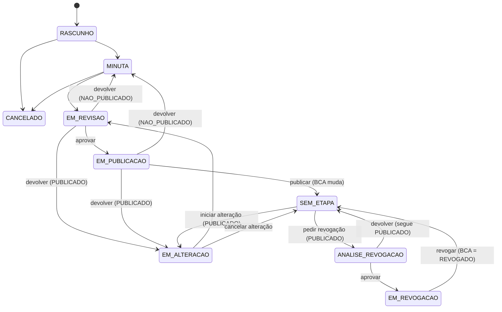

# Ciclo de Vida do Documento

A situação de um documento é **duas coisas independentes**, e nunca uma só:

| | Situação BCA | Situação Local |
|---|---|---|
| **O que é** | A situação **real**: espelha o repositório oficial (o BCA) | A **etapa interna** em curso no sistema (elaboração, revisão, alteração...) — não existe na vida real |
| **Valores** | `NAO_PUBLICADO` · `PUBLICADO` · `REVOGADO` | `RASCUNHO` · `MINUTA` · `EM_REVISAO` · `EM_PUBLICACAO` · `EM_ALTERACAO` · `ANALISE_REVOGACAO` · `EM_REVOGACAO` · `CANCELADO` · `SEM_ETAPA` |
| **Quando muda** | **Só** ao registrar portaria + BCA (publicar → `PUBLICADO`; revogar → `REVOGADO`) | A cada passo do fluxo. Só **uma etapa local por vez**; `SEM_ETAPA` = nenhuma em curso |
| **Na tela** | Chip principal | Chip secundário (só aparece quando há etapa em curso) |

O motivo da separação: um ato oficialmente **publicado** não deixa de estar publicado só porque alguém abriu uma alteração ou pediu a análise de uma revogação. O sistema nunca mostra apenas "Em Alteração" quando, oficialmente, o documento é `PUBLICADO` — a situação BCA é sempre visível.

Combinações que existem (`SituacaoLocalEnum` documenta as mesmas):

| Situação BCA | Situações locais possíveis |
|---|---|
| `NAO_PUBLICADO` | `RASCUNHO`, `MINUTA`, `EM_REVISAO`, `EM_PUBLICACAO`, `CANCELADO` |
| `PUBLICADO` | `SEM_ETAPA`, `EM_ALTERACAO`, `EM_REVISAO`, `EM_PUBLICACAO`, `ANALISE_REVOGACAO`, `EM_REVOGACAO` |
| `REVOGADO` | `SEM_ETAPA` |

> **NPA:** a [NPA](dominio.md#npa-norma-padrao-de-acao) percorre o mesmo caminho de elaboração, revisão, publicação e revogação, mas **sem alteração**: não existe a etapa `EM_ALTERACAO`, nem iniciar/cancelar alteração, nem ciclo de emenda. "Devolver" leva sempre à `MINUTA`. Para mudar uma NPA publicada cria-se outra e revoga-se a anterior (`CicloDeVidaDeNpa`).

## Transições da Situação Local

Validadas no servidor por `DocumentoStatusService.changeStatus()` — tentativas inválidas resultam em `StatusCannotBeUpdatedException` (`403`, "Transição não permitida: X → Y (situação BCA: Z)."). O pedido (`PATCH /v1/documentos/{id}/status`) sempre informa a **nova situação local** (`situacaoLocal`); `SEM_ETAPA` como destino significa **concluir a etapa em curso** — o que isso quer dizer depende da origem (tabela abaixo).

| Origem → destino pedido | Ação | Efeito na Situação BCA |
|---|---|---|
| `RASCUNHO → MINUTA` | minutar | — |
| `RASCUNHO/MINUTA → CANCELADO` | cancelar o documento | — |
| `MINUTA/EM_ALTERACAO → EM_REVISAO` | enviar para revisão (escolhe o revisor) | — |
| `EM_REVISAO → EM_PUBLICACAO` | aprovar (escolhe o publicador) — congela a versão em tramitação | — |
| `EM_REVISAO/EM_PUBLICACAO → MINUTA` (`NAO_PUBLICADO`) ou `→ EM_ALTERACAO` (`PUBLICADO`) | devolver | — (nunca tira um documento publicado de `PUBLICADO`) |
| `EM_PUBLICACAO → SEM_ETAPA` | **publicar** (portaria + BCA) | `NAO_PUBLICADO → PUBLICADO` (1ª publicação); segue `PUBLICADO` numa alteração |
| `SEM_ETAPA → EM_ALTERACAO` | iniciar alteração (só `PUBLICADO`) | — |
| `EM_ALTERACAO → SEM_ETAPA` | **cancelar alteração** — só sem alterações pendentes (desfeitas antes, elemento a elemento) | — (segue `PUBLICADO`) |
| `SEM_ETAPA → ANALISE_REVOGACAO` | pedir revogação (só `PUBLICADO`; escolhe o revisor) | — |
| `ANALISE_REVOGACAO → EM_REVOGACAO` | aprovar a revogação (escolhe o publicador) | — |
| `ANALISE_REVOGACAO → SEM_ETAPA` | devolver a análise — não exige nada | — (segue `PUBLICADO`) |
| `EM_REVOGACAO → SEM_ETAPA` | **revogar** (portaria + BCA) — a única saída de `EM_REVOGACAO` | `PUBLICADO → REVOGADO` |

**Não há revogação durante uma alteração** (`EM_ALTERACAO → ANALISE_REVOGACAO` não existe): primeiro conclui-se ou cancela-se a alteração. E **`EM_REVOGACAO` nunca volta a `PUBLICADO`** — não há para onde devolver.

**Atribuição pessoal, não papel genérico — cada transição tem um dono diferente:**

| Transição | Quem pode |
|---|---|
| `RASCUNHO/MINUTA → CANCELADO`, `→ MINUTA`, `→ EM_REVISAO`, `SEM_ETAPA → ANALISE_REVOGACAO` | Quem já pode editar o documento (autor/coautor com papel **Editor**) — inclui **escolher pessoalmente** quem vai revisar (`revisorId`, restrito a quem tem papel **Aprovador** na mesma OM) |
| `SEM_ETAPA → EM_ALTERACAO` | Qualquer **Aprovador** da mesma OM — única transição sem atribuição prévia (é uma iniciativa nova, não a continuação de uma fila) |
| `EM_ALTERACAO → SEM_ETAPA` (cancelar alteração) | Qualquer **Aprovador** da mesma OM **ou** quem edita o documento (autor/coautor) |
| A partir de `EM_REVISAO`/`ANALISE_REVOGACAO` (aprovar, aprovar revogação, devolver) | Só a pessoa atribuída como revisora daquele documento (`Documento.revisorAtribuido`) — ao aprovar, ela também escolhe pessoalmente quem vai publicar (`publicadorId`, papel **Publicador**) |
| A partir de `EM_PUBLICACAO` (publicar, devolver) e `EM_REVOGACAO` (revogar — **não há devolução**) | Só a pessoa atribuída como publicadora daquele documento (`Documento.publicadorAtribuido`) |

A checagem é centralizada em `DocumentoAcessoService.podeMudarStatus()`; tentativas sem a atribuição/papel adequado retornam `403`. Cada atribuição **notifica só a pessoa escolhida** (`NotificacaoService.notificarAtribuicao`), nunca uma OM inteira — ver [Autenticação e Colaboração](autenticacao.md). Devolver limpa a atribuição: a próxima vez que o documento for enviado, a pessoa pode ser outra.

**Editar durante a revisão:** o Aprovador atribuído pode editar o conteúdo enquanto o documento **ainda não publicado** estiver em `EM_REVISAO`. A revisão de uma alteração de documento `PUBLICADO` é somente leitura: o texto vigente só muda por emenda, na etapa `EM_ALTERACAO`. A partir de `EM_PUBLICACAO` — e em todo o fluxo de revogação — ninguém mais edita o conteúdo, nem o autor original.

**Regra de imutabilidade:** o conteúdo textual só pode ser alterado em `RASCUNHO`, `MINUTA` (edição livre) ou `EM_ALTERACAO` (só por emenda, elemento a elemento). O salvamento em massa é rejeitado para qualquer documento `PUBLICADO`. Para criar uma revisão totalmente nova, use a **clonagem**, que gera um novo documento em `RASCUNHO` com novo número secundário, preservando o original como registro histórico.

## Versões do documento: vigente × em tramitação

Cada documento tem até duas versões (PDF/HTML):

| Versão | Existe quando | Como é obtida |
|---|---|---|
| **Vigente** (BCA) | O documento já foi publicado (`PUBLICADO` ou `REVOGADO`) | **Armazenada** no MinIO (`urlPdf`/`urlHtml`); só é (re)gerada ao registrar portaria/BCA (publicar ou revogar). Sem marca d'água |
| **Em tramitação** | Há etapa local em curso (`Situação Local ≠ SEM_ETAPA`) | Nas etapas em que o texto ainda muda (`RASCUNHO`, `MINUTA`, `EM_REVISAO`, `EM_ALTERACAO`, `ANALISE_REVOGACAO`) é **gerada na hora**, com marca d'água. Ao **aprovar** (`EM_PUBLICACAO`/`EM_REVOGACAO`) é **congelada** e armazenada (`urlPdfTramitacao`/`urlHtmlTramitacao`), para o publicador ver exatamente o que será publicado. É descartada ao publicar, revogar, devolver ou cancelar |

Os arquivos armazenados são gerados **depois do commit** da mudança de etapa (`DocumentoStatusService.aposCommit`): a geração lê o documento numa transação própria e, antes do commit, enxergaria as cláusulas de emenda ainda pendentes (placeholder `XYZ/ABC`) e a situação BCA antiga. Falha na geração não desfaz a mudança de etapa (fica registrada no log; a exportação cai na renderização ao vivo).

`GET /v1/documentos/{id}/pdf` e `/html` aceitam `?versao=VIGENTE|TRAMITACAO`. Sem o parâmetro, o padrão é a versão **em tramitação, se houver**, senão a vigente; pedir uma versão que o documento não tem retorna `404`. A tela de visualização segue a mesma regra: abre a versão em tramitação por padrão e oferece o alternador para a versão vigente (BCA); sem etapa em curso, mostra direto a vigente. Os botões PDF/HTML da barra superior oferecem as duas versões quando ambas existem.

!!! note "Migração dos dados existentes"
    A migração `V2` converte o modelo antigo (uma única coluna de status) para as duas situações: `PUBLICADO`/`REVOGADO` antigos viram situação BCA + `SEM_ETAPA`; `APROVADO`/`ALTERADO` (que já cascateavam para `EM_PUBLICACAO`) viram `EM_PUBLICACAO`; o PDF/HTML gravado numa etapa em tramitação passa para as colunas da versão em tramitação. A situação BCA antiga é deduzida de `dtPublicacao`.

## Revogação em três etapas

Revogar um ato publicado segue o mesmo padrão de atribuição pessoal do fluxo normal: o Editor envia (`SEM_ETAPA → ANALISE_REVOGACAO`, escolhendo um Aprovador), o Aprovador atribuído analisa e aprova a revogação (`ANALISE_REVOGACAO → EM_REVOGACAO`, escolhendo um Publicador) ou devolve (`ANALISE_REVOGACAO → SEM_ETAPA`: o pedido é recusado e o documento **segue `PUBLICADO`**, sem exigir nada), e o Publicador atribuído formaliza (`EM_REVOGACAO → SEM_ETAPA`, com Portaria/BCA — a Situação BCA passa a `REVOGADO`). A revogação não reabre o conteúdo do documento para edição em nenhuma etapa.

## Portaria, BCA e registro de publicações

Publicar (`EM_PUBLICACAO → SEM_ETAPA`) e revogar (`EM_REVOGACAO → SEM_ETAPA`), sempre pela pessoa atribuída como publicadora, exigem o registro de uma **Portaria** (órgão, setor, número, data) e de um **BCA** (número, data), além do upload do PDF da portaria correspondente. Esse registro é gravado como uma linha própria em `PortariaPublicacao`, nunca mesclado ao PDF do documento — cada portaria permanece um arquivo íntegro, condição necessária para uma futura assinatura digital (que cobre um intervalo de bytes exato do arquivo original; um merge invalidaria essa assinatura).

O tipo de cada registro é decidido pela **Situação BCA** do documento no momento:

| Situação | Tipo registrado (`TipoPortariaPublicacaoEnum`) | Numeração sequencial |
|---|---|---|
| `NAO_PUBLICADO` → publicando (1ª edição) | `EDICAO` | Não (ocorre uma única vez) |
| `PUBLICADO` → publicando uma alteração | `ALTERACAO` | Sim — 1ª, 2ª, 3ª... calculado por `PortariaPublicacaoRepository.findMaxNumeroSequencialAlteracao()` |
| `PUBLICADO` → revogando (`EM_REVOGACAO → SEM_ETAPA`) | `REVOGACAO` | Não (ocorre uma única vez) |

Todas as portarias registradas de um documento aparecem na tela de visualização, na seção **Portarias** (ver [Funcionalidades](funcionalidades.md#visualizacao-do-documento)), acessíveis via `GET /v1/documentos/{id}/portarias`.

**A parte preliminar é da primeira publicação — e só dela.** Antes dela o documento não exibe a Portaria (nem na prévia, nem no PDF, nem no HTML). Somente a portaria de **publicação** aparece na parte preliminar do documento (epígrafe, ementa, preâmbulo, fecho e assinatura), e ela é **perene**: nunca é sobrescrita. As portarias de alteração aparecem como **cláusula em cada elemento alterado** (ver ciclo de emenda abaixo) e a de revogação total, pelo selo `REVOGADO`. Por isso:

- a **primeira publicação** exige Portaria + BCA + PDF **e** a parte preliminar inteira (o serviço rejeita se faltar qualquer um dos cinco campos) e é a única que a grava;
- uma **alteração** e uma **revogação** exigem apenas Portaria + BCA + PDF da portaria, e **não** tocam na parte preliminar;
- `dtPublicacao` é a data da **primeira** publicação; as datas das alterações ficam nas portarias (`PortariaPublicacao`) e nas cláusulas dos elementos.

## Ciclo de emenda — alterando um ato já publicado

Um ato normativo publicado não é reescrito livremente: a LC 95/1998 exige que alterações a um dispositivo já em vigor apareçam com a redação anterior riscada ao lado da nova, cada uma com sua própria cláusula de referência ("*incluído pela Portaria X, publicada no BCA Y*"). O FAB Legis modela isso como um ciclo em cima do próprio elemento (artigo, parágrafo, inciso…), não do documento inteiro:

1. O documento (`PUBLICADO`, `SEM_ETAPA`) vai a `EM_ALTERACAO`.
2. Cada elemento tocado recebe uma ação — `INCLUIR`, `ALTERAR`, `REVOGAR` ou `DESFAZER` (desiste da edição pendente) — via `PATCH /v1/documentos/{id}/emendar/{secao}/{elementoId}`. O `ElementoEmendaStatusEnum` (`INALTERADO · INCLUIDO · ALTERADO · REVOGADO`) e o texto anterior ficam guardados no próprio registro do elemento; nada é sobrescrito.
   A cláusula tem a mesma forma em todos os formatos (prévia, PDF e HTML): alteração → "*(redação dada pela Portaria X, publicada no BCA Y)*"; inclusão → "*(incluído pela ...)*"; revogação → "*(revogado pela ...)*".
3. O documento passa por `EM_REVISAO` (Aprovador atribuído aprova) e `EM_PUBLICACAO` até a publicação da alteração (`EM_PUBLICACAO → SEM_ETAPA`, com nova Portaria/BCA — ver seção anterior), quando `EmendaService.consolidarPublicacao()` **congela** a cláusula de cada elemento alterado — ela deixa de ser recalculada e passa a valer para sempre, mesmo que o documento entre em um novo ciclo depois. O documento continua `PUBLICADO` durante todo o ciclo.
4. **Desfazer uma alteração** é feito **por elemento**: apagar a alteração do elemento no painel lateral do editor (`DESFAZER`). **Desistir da alteração inteira** (`EM_ALTERACAO → SEM_ETAPA`) só é possível quando **não há mais alterações pendentes** (`EmendaService.temAlteracoesPendentes()`); com alguma pendente, o serviço recusa e pede para desfazê-las antes — o cancelamento nunca descarta trabalho em massa.
5. Uma nova emenda sobre um elemento **já publicado** promove a redação vigente e reinicia o ciclo para aquele elemento — o texto anterior a essa nova emenda também fica registrado (`clausulaEmendaAnterior`), aparecendo riscado ao lado da cláusula que o descreveu originalmente.
6. Artigos incluídos por emenda recebem sufixo de letra (`Art. 5-A`) e **nunca** voltam a consumir numeração sequencial simples, mesmo depois de alterados ou revogados — a marca `incluidoPorEmenda` é permanente e independente do status ao vivo do elemento, evitando a renumeração de todo o documento a cada novo ciclo (vedada pela técnica legislativa).

## Quadro de Justificativas das Modificações Propostas

A cada ciclo de emenda, o sistema monta automaticamente o **Anexo XXIV da NSCA 5-3** — a tabela (referência · texto em vigor · texto proposto · justificativa) que a autoridade exige junto da nova redação antes de aprovar a publicação. Fica disponível na página **Comparar Versões** (`/documento/{id}/comparar`):

- o seletor de **ciclo** lista tanto a rodada em andamento (ainda não publicada, comparada contra o texto vigente) quanto todos os ciclos já publicados anteriormente, cada um com sua própria Portaria/BCA;
- cards de comparação lado a lado/unificado por elemento (`DiffViewer`, com destaque de palavras via `diff`), incluindo anexos com imagem;
- **exportação em PDF** (`POST /{id}/mapa-alteracao/pdf`) no mesmo motor Apache FOP/XSL-FO do documento oficial — A4 paisagem, texto excluído em vermelho, texto inserido em azul, abre em nova aba;
- para o ciclo pendente atual, o botão **Texto Sugerido** gera um rascunho da própria redação da portaria de alteração (ver [Texto sugerido da portaria](exportacao-pdf.md#texto-sugerido-da-portaria-nsca-5-3-art-22)).
