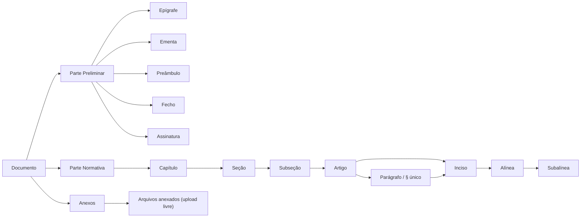

# Modelo de Domínio

O ato normativo é decomposto em três partes, conforme a técnica legislativa:

## Capítulos padronizados (NSCA 5-3)

Todo documento novo já nasce com a estrutura padrão da **NSCA 5-3, Seção X (arts. 63 a 67)** na Parte Normativa — a mesma para todas as espécies normativas, criada por `CapitulosPadronizadosService` dentro de `DocumentoService.create`:

| Capítulo | Aplicação | Norma | Seções e artigos criados |
|---|---|---|---|
| **DISPOSIÇÕES PRELIMINARES** | Obrigatório — sempre o **primeiro** | Art. 63 e 64 | Seção **Finalidade** (1 artigo) e seção **Âmbito** (1 artigo, que deve descrever claramente a aplicabilidade da publicação) |
| **DISPOSIÇÕES GERAIS** | Eventual — o **antepenúltimo** | Art. 65 | 1 artigo (disposições de caráter geral ou matéria relacionada com assuntos de mais de um capítulo) |
| **DISPOSIÇÕES TRANSITÓRIAS** | Eventual — o **penúltimo** | Art. 66 | 1 artigo (providências condicionadas a eventos futuros, prazos determinados, preceitos que perdem vigência) |
| **DISPOSIÇÕES FINAIS** | Obrigatório — sempre o **último** | Art. 67 | Seção **Substituição de publicações** (1 artigo) e seção **Casos não previstos** (1 artigo, com a atribuição para solucioná-los) |

Como funciona na prática:

- Os textos dos artigos entre colchetes (`[descrever a finalidade da publicação]`) são **orientação de preenchimento**, não redação definitiva — o autor substitui. Nos capítulos de aplicação eventual, se não forem necessários, basta **excluir o capítulo inteiro**.
- Fora dos colchetes, onde o texto fala do próprio documento, a palavra "publicação" é trocada pela **espécie normativa criada**, com a concordância de gênero: numa ICA, `Esta instrução tem por finalidade […]`; numa DCA, `Esta diretriz…`; num MCA, `Este manual…`; numa NSCA, `Esta norma de sistema…`. O substantivo sai do nome cadastrado da espécie (sem o "do Comando da Aeronáutica") e o gênero fica em `CapitulosPadronizadosService`; uma espécie cadastrada depois e ainda fora dessa lista mantém "publicação", o termo genérico da NSCA 5-3. O texto **dentro dos colchetes** não muda.
- Os capítulos do assunto da publicação são inseridos **entre Disposições Preliminares e Disposições Gerais**; a numeração (Capítulo I…, Seção I…, Art. 1º…) é sempre calculada pela estrutura, então tudo se renumera sozinho — nada disso é gravado no banco.
- A estrutura só é criada na **criação** do documento: documentos já existentes não são alterados, e o clone (`/{id}/clonar`) copia a estrutura do original em vez de recriá-la.

## Numeração oficial do documento

A identificação de um ato — por exemplo **`ICA 5-3`** — é composta por:

| Componente | Origem | Exemplo |
|---|---|---|
| **Espécie Normativa** | `EspecieNormativaEnum` | `ICA` (Instrução do Comando da Aeronáutica) |
| **Assunto Básico** | `AssuntoBasicoEnum` | `5` (Publicações) |
| **Número Secundário** | Calculado pelo sistema | `3` |

O **número secundário é atribuído automaticamente** pelo `DocumentoService.calculateSecondaryNumber()`: o serviço busca todos os documentos da mesma combinação Espécie + Assunto e **reaproveita a primeira lacuna** na sequência, evitando buracos na numeração do acervo.

O catálogo de espécies inclui DCA, FCA, ICA, MCA, NSCA, OCA, PCA, RCA, RICA, ROCA e TCA — cada uma com nome e descrição normativa completa. Os assuntos básicos cobrem toda a tabela oficial (Doutrina Aeroespacial, Publicações, Tecnologia da Informação, Pessoal, Ensino, Governança, Projetos e demais).

## Numeração automática conforme a técnica legislativa

Segue o **Decreto nº 12.002/2024, art. 9º**:

| Elemento | Formato | Exemplo |
|---|---|---|
| Capítulo / Seção / Subseção | Romano | `CAPÍTULO IV` |
| Artigo | Ordinal até o 9º, cardinal a partir do 10 (com separador de milhar) | `Art. 3º` · `Art. 12.` · `Art. 1.024.` |
| Parágrafo | Ordinal/cardinal com `§` | `§ 1º` · `§ 10.` |
| Parágrafo único | Literal | `Parágrafo único` |
| Inciso | Romano | `VII` |
| Alínea | Letra minúscula | `c)` |
| Subalínea (item) | Arábico | `2.` |
| Artigo incluído por emenda | Sufixo de letra, permanente | `Art. 5-A` |
| Parágrafo incluído por emenda | Sufixo de letra, permanente | `§ 2º-A` |

A renumeração é **recalculada a cada mutação da árvore** — inserir um artigo no meio do documento reordena todos os subsequentes automaticamente, exceto os incluídos por emenda (sufixo de letra, nunca renumerados — ver [Ciclo de emenda](ciclo-de-vida.md#ciclo-de-emenda-alterando-um-ato-ja-publicado)). A mesma proteção vale para parágrafo: o Decreto nº 12.002/2024, art. 14, IV veda expressamente a renumeração de parágrafo já em vigor, então um parágrafo incluído por emenda entre dois já publicados recebe sufixo de letra em vez de deslocar a numeração dos seguintes — o mesmo mecanismo de `Art. 5º-A`, aplicado também a parágrafo.

!!! note "Cálculo local com reconciliação do servidor (capítulo/seção/subseção/artigo)"
    O algoritmo ainda existe em duas implementações — `frontend/src/utils/numbering.js` e `NumeracaoService.java` (backend) — de propósito, não por descuido: o cálculo local dá feedback instantâneo enquanto o usuário arrasta/promove/rebaixa um elemento, sem esperar uma chamada de rede a cada interação. O que mudou é que, nos pontos onde já existe um *round-trip* de qualquer forma — salvar a estrutura (`PATCH /{id}/secoes`) e toda leitura do documento (`GET /{id}`, inclusive após uma ação do diálogo de emenda) — o backend devolve a numeração que ele mesmo calculou, e o frontend sobrescreve o valor local com ela. Isso elimina o risco de as duas implementações divergirem silenciosamente, sem pagar o custo de latência de tornar o backend a única fonte chamada a cada interação.

    **Parágrafo continua fora dessa reconciliação** — `NumeracaoService` cobre só capítulo/seção/subseção/artigo; a numeração de parágrafo (local ao artigo) permanece calculada em paralelo por `numbering.js` (frontend) e `DocumentoFoCorpoBuilder.java` (PDF), sem um ponto único ainda.

Inciso, alínea e subalínea são numerados por contadores posicionais simples entre irmãos do mesmo tipo dentro do mesmo pai — mirrorado entre os métodos privados de `DocumentoFoCorpoBuilder.java` (backend) e a própria travessia de árvore do frontend — e **não** têm a proteção de sufixo de letra que artigo e parágrafo têm: inserir um inciso no meio de um dispositivo já publicado desloca a numeração dos seguintes. O Decreto nº 12.002/2024 não veda isso expressamente para esses níveis (a vedação do art. 14, IV é específica de parágrafo), então essa é uma decisão de escopo deliberada, não um bug.
