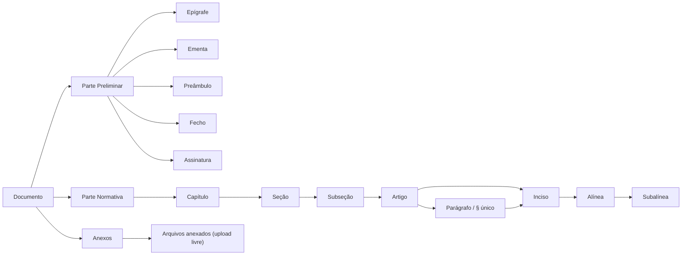

# Modelo de Domínio

O ato normativo é decomposto em três partes, conforme a técnica legislativa:

## Capítulos padronizados (NSCA 5-3)

Todo documento novo já nasce com a estrutura padrão da **NSCA 5-3, Seção X (arts. 63 a 67)** na Parte Normativa — a mesma para todas as espécies normativas, criada por `CapitulosPadronizadosService` dentro de `DocumentoService.create`:

| Capítulo | Aplicação | Norma | Seções e artigos criados |
|---|---|---|---|
| **DISPOSIÇÕES PRELIMINARES** | Obrigatório — sempre o **primeiro** | Art. 63 e 64 | Seção **Finalidade** (1 artigo) e seção **Âmbito** (1 artigo, que deve descrever claramente a aplicabilidade da publicação) |
| **DISPOSIÇÕES GERAIS** | Eventual — o **antepenúltimo** | Art. 65 | 1 artigo (disposições de caráter geral ou matéria relacionada com assuntos de mais de um capítulo) |
| **DISPOSIÇÕES TRANSITÓRIAS** | Eventual — o **penúltimo** | Art. 66 | 1 artigo (providências condicionadas a eventos futuros, prazos determinados, preceitos que perdem vigência) |
| **DISPOSIÇÕES FINAIS** | Obrigatório — sempre o **último** | Art. 67 | Seção **Substituição de publicações** (1 artigo) e seção **Casos não previstos** (1 artigo, com a atribuição para solucioná-los) |

Como funciona na prática:

- Os textos dos artigos entre colchetes (`[descrever a finalidade da publicação]`) são **orientação de preenchimento**, não redação definitiva — o autor substitui. Para chamar a atenção do autor, esse trecho (colchetes incluídos) **já nasce em vermelho** no documento novo: é uma cor comum do TipTap (`textStyle`, `#FF0000`) gravada só neste modelo, então aparece igual no editor, na prévia, no PDF e no HTML. Daí em diante o texto é do autor, que mantém ou muda a cor pelo próprio editor à medida que desenvolve o texto — nenhum outro texto entre colchetes é destacado, e nada é decidido na hora de exibir. Nos capítulos de aplicação eventual, se não forem necessários, basta **excluir o capítulo inteiro**.
- Fora dos colchetes, onde o texto fala do próprio documento, a palavra "publicação" é trocada pela **espécie normativa criada**, com a concordância de gênero: numa ICA, `Esta instrução tem por finalidade […]`; numa DCA, `Esta diretriz…`; num MCA, `Este manual…`; numa NSCA, `Esta norma de sistema…`. O substantivo sai do nome cadastrado da espécie (sem o "do Comando da Aeronáutica") e o gênero fica em `CapitulosPadronizadosService`; uma espécie cadastrada depois e ainda fora dessa lista mantém "publicação", o termo genérico da NSCA 5-3. O texto **dentro dos colchetes** não muda.
- Os capítulos do assunto da publicação são inseridos **entre Disposições Preliminares e Disposições Gerais**; a numeração (Capítulo I…, Seção I…, Art. 1º…) é sempre calculada pela estrutura, então tudo se renumera sozinho — nada disso é gravado no banco.
- A estrutura só é criada na **criação** do documento: documentos já existentes não são alterados, e o clone (`/{id}/clonar`) copia a estrutura do original em vez de recriá-la.

## Numeração oficial do documento

A identificação de um ato — por exemplo **`ICA 5-3`** — é composta por:

| Componente | Origem | Exemplo |
|---|---|---|
| **Espécie Normativa** | `EspecieNormativaEnum` | `ICA` (Instrução do Comando da Aeronáutica) |
| **Assunto Básico** | `AssuntoBasicoEnum` | `5` (Publicações) |
| **Número Secundário** | Calculado pelo sistema | `3` |

A identificação é gravada na criação (`Documento.identificacao`) e nunca recalculada; quem a monta é a regra de criação da espécie (`RegrasDeCriacaoDoDocumento`). O **número secundário é atribuído automaticamente** por `CriacaoDeEspecieConvencional`: o serviço busca todos os documentos da mesma combinação Espécie + Assunto e **reaproveita a primeira lacuna** na sequência, evitando buracos na numeração do acervo.

O catálogo de espécies inclui DCA, FCA, ICA, MCA, NSCA, OCA, PCA, RCA, RICA, ROCA e TCA — cada uma com nome e descrição normativa completa. Os assuntos básicos cobrem toda a tabela oficial (Doutrina Aeroespacial, Publicações, Tecnologia da Informação, Pessoal, Ensino, Governança, Projetos e demais).

## Numeração automática conforme a técnica legislativa

Segue o **Decreto nº 12.002/2024, art. 9º**:

| Elemento | Formato | Exemplo |
|---|---|---|
| Capítulo / Seção / Subseção | Romano | `CAPÍTULO IV` |
| Artigo | Ordinal até o 9º, cardinal a partir do 10 (com separador de milhar) | `Art. 3º` · `Art. 12.` · `Art. 1.024.` |
| Parágrafo | Ordinal/cardinal com `§` | `§ 1º` · `§ 10.` |
| Parágrafo único | Literal | `Parágrafo único` |
| Inciso | Romano | `VII` |
| Alínea | Letra minúscula | `c)` |
| Subalínea (item) | Arábico | `2.` |
| Artigo incluído por emenda | Sufixo de letra, permanente | `Art. 5-A` |
| Parágrafo incluído por emenda | Sufixo de letra, permanente | `§ 2º-A` |

A renumeração é **recalculada a cada mutação da árvore** — inserir um artigo no meio do documento reordena todos os subsequentes automaticamente, exceto os incluídos por emenda (sufixo de letra, nunca renumerados — ver [Ciclo de emenda](ciclo-de-vida.md#ciclo-de-emenda-alterando-um-ato-ja-publicado)). A mesma proteção vale para parágrafo: o Decreto nº 12.002/2024, art. 14, IV veda expressamente a renumeração de parágrafo já em vigor, então um parágrafo incluído por emenda entre dois já publicados recebe sufixo de letra em vez de deslocar a numeração dos seguintes — o mesmo mecanismo de `Art. 5º-A`, aplicado também a parágrafo. Um dispositivo **revogado continua ocupando o número que tinha**: revogar não abre vaga nem renumera, e um artigo, capítulo ou seção incluído por emenda antes dele recebe letra (`Art. 1º-A`), nunca o número do revogado (LC 95/1998) — regra idêntica no frontend (`numbering.js`) e no backend (`NumeracaoService`), ambos cobertos por testes. A mesma regra vale para o **parágrafo** (Decreto nº 12.002/2024, art. 14, IV): um parágrafo em vigor nunca é renumerado, e a decisão usa a marca permanente `incluidoPorEmenda` (não o status ao vivo), então nem um parágrafo revogado nem a alteração de um incluído deslocam o rótulo dos demais. Antes da primeira publicação (`RASCUNHO`/`MINUTA`) a numeração é livre e recalculada a cada edição. Essa regra vale **nos três lugares que numeram**: a prévia do editor (`numbering.js`), o PDF e o HTML — o HTML exportado usa o mesmo `NumeracaoService` do PDF (antes usava contadores próprios e renumerava artigo, capítulo e seção incluídos por emenda).

!!! note "Cálculo local com reconciliação do servidor (capítulo/seção/subseção/artigo)"
    O algoritmo ainda existe em duas implementações — `frontend/src/utils/numbering.js` e `NumeracaoService.java` (backend) — de propósito, não por descuido: o cálculo local dá feedback instantâneo enquanto o usuário arrasta/promove/rebaixa um elemento, sem esperar uma chamada de rede a cada interação. O que mudou é que, nos pontos onde já existe um *round-trip* de qualquer forma — salvar a estrutura (`PATCH /{id}/secoes`) e toda leitura do documento (`GET /{id}`, inclusive após uma ação do diálogo de emenda) — o backend devolve a numeração que ele mesmo calculou, e o frontend sobrescreve o valor local com ela. Isso elimina o risco de as duas implementações divergirem silenciosamente, sem pagar o custo de latência de tornar o backend a única fonte chamada a cada interação.

    **Parágrafo continua fora dessa reconciliação** — o `calcular()` de `NumeracaoService` cobre só capítulo/seção/subseção/artigo; a numeração de parágrafo (local ao artigo) tem a própria regra em `NumeracaoService.numerarParagrafos` (usada pelo PDF/HTML via `DocumentoFoCorpoBuilder`) e espelhada em `numbering.js` — as duas implementações são cobertas pelos mesmos cenários de teste, mas o backend ainda não devolve o rótulo do parágrafo pela API para o frontend reconciliar.

### Parágrafo único que vira "§ 1º"

É o **único caso** em que um parágrafo é renumerado: quando um artigo com *parágrafo único* em vigor ganha um 2º parágrafo (incluído por emenda), o parágrafo único passa a ser "§ 1º" e o novo é "§ 2º". Como a renumeração precisa ficar visível, a linha inteira `Parágrafo único. texto` sai **riscada** e o mesmo texto se repete logo abaixo sob `§ 1º`, com a cláusula "*(redação dada pela Portaria X, publicada no BCA Y)*" — a mesma forma das demais cláusulas de alteração — — na prévia do editor, no PDF, no HTML, no quadro de comparação e no [texto sugerido da portaria](exportacao-pdf.md#texto-sugerido-da-portaria-nsca-5-3-art-22). Regras:

- só vale para um parágrafo único **em vigor**: num documento ainda `NAO_PUBLICADO` a numeração é livre (nada é riscado), e um único incluído por emenda ainda pendente também não estava em vigor (`NumeracaoService.unicoRenumerado`, espelhado em `numbering.js`);
- enquanto a alteração não é publicada, a cláusula usa o placeholder `XYZ/ABC` (como toda cláusula pendente); ao publicar, `EmendaService.consolidarPublicacao` congela a cláusula em `ItemAnexoParteNormativa.clausulaRenumeracao` (coluna `tx_clausula_renumeracao`, migração `V3`), e o riscado passa a ser **permanente**;
- desfazer a inclusão do 2º parágrafo antes da publicação devolve o `Parágrafo único` ao normal — nada é gravado até a publicação.

Inciso, alínea e subalínea são numerados por contadores posicionais simples entre irmãos do mesmo tipo dentro do mesmo pai — mirrorado entre os métodos privados de `DocumentoFoCorpoBuilder.java` (backend) e a própria travessia de árvore do frontend — e **não** têm a proteção de sufixo de letra que artigo e parágrafo têm: inserir um inciso no meio de um dispositivo já publicado desloca a numeração dos seguintes. O Decreto nº 12.002/2024 não veda isso expressamente para esses níveis (a vedação do art. 14, IV é específica de parágrafo), então essa é uma decisão de escopo deliberada, não um bug.

## NPA — Norma Padrão de Ação

A **NPA** é uma espécie de **uso interno da OM**, para disciplinar rotinas internas (modelo: Anexo XII da NSCA 5-3). Ao contrário das Espécies Convencionais — produzidas pelas OM, mas de âmbito que extrapola a OM —, ela tem elementos, numeração, layout e ciclo de vida **próprios**; por isso, como a NSCA 5-3 a enquadra entre as **Espécies de Comunicações Oficiais Padronizadas** (Capítulo VIII, Seção VIII) — e não entre as Espécies Convencionais (MCA, NSCA, ICA, ROCA…) —, segue o tipo de espécie `COMUNICACAO_OFICIAL_PADRONIZADA` (`RegrasDeComunicacaoOficialPadronizada`, ver [Arquitetura](arquitetura.md#regras-por-especie-normativa-atras-de-interfaces)). A **distribuição é sempre ostensiva**: toda NPA é visível para todas as OM.

### Identificação

Texto livre informado na criação (`NPA-AGO-01`, `NPA 44-__/2026`… — cada setor tem o seu padrão), de até 120 caracteres. **Não há assunto básico nem sequencial gerado**; o "assunto" do cabeçalho é o título do documento (`CriacaoDeNpa`).

### Elementos e hierarquia

Só existem **capítulo, seção, subseção, parágrafo e alínea** — sem artigo, inciso, parágrafo único nem subalínea. O **parágrafo** é o dispositivo em si (o elemento que tem o texto) e o backend recusa, no salvamento, qualquer combinação fora desta tabela (`HierarquiaDeNpa`):

| Elemento | Onde pode ficar |
|---|---|
| Capítulo | na raiz do documento |
| Seção | sob um capítulo |
| Subseção | sob uma seção |
| Parágrafo | sob um capítulo, uma seção ou uma subseção |
| Alínea | **só** sob um parágrafo |

### Numeração

Algarismo arábico pelo **caminho** do elemento; **todo elemento é numerado** e a numeração é sempre recalculada (não há emenda, nada é congelado nem recebe sufixo de letra) — `NumeracaoDeNpa`:

| Elemento | Formato | Exemplo |
|---|---|---|
| Capítulo | número | `3` |
| Seção | capítulo `.` posição | `1.1` |
| Subseção | seção `.` posição | `1.1.1` |
| Parágrafo | número do pai `.` posição | `3.1` (sob o capítulo 3) · `1.1.1` (sob a seção 1.1) · `1.1.1.1` (sob a subseção 1.1.1) |
| Alínea | letra pela posição entre as alíneas do parágrafo | `a)`, `b)` |

Seção, subseção e parágrafo **do mesmo pai dividem uma única sequência**: num capítulo com a seção `1.1`, um parágrafo colocado depois dela recebe `1.2`.

### Estrutura com que a NPA nasce

`EstruturaInicialDeNpa` (layout do Anexo XII): `1 DISPOSIÇÕES PRELIMINARES` (`1.1 Finalidade`, `1.2 Âmbito`, `1.3 Referências`), `2 DISPOSIÇÕES GERAIS` (`2.1 Conceituações`) e `3 DISPOSIÇÕES FINAIS` (parágrafo direto, `3.1`). Como a alínea só existe depois de um parágrafo, a seção Referências nasce com o parágrafo introdutório **"Constituem referências:"** seguido da alínea. Os textos de orientação entre colchetes nascem em vermelho, como nos atos normativos.

### Campos do cabeçalho e do fecho

O cabeçalho da NPA é uma tabela de campos, não uma parte preliminar. Os campos que só ela tem ficam em `t_documento_npa` (`CamposDaNpa`, uma linha por documento, migração `V8`), fora de `Documento`:

| Campo | Origem |
|---|---|
| **Identificação** | `Documento.identificacao` (texto livre, informado na criação) |
| **Setor emissor** | `CamposDaNpa.setorEmissor` — texto livre, abaixo da OM |
| **Local** | `CamposDaNpa.local` — do fecho "Local, dd de mês de aaaa"; a data é a da aprovação |
| **Assinaturas** | `CamposDaNpa.assinaturas` — blocos em **texto livre**: um rótulo ("Visto", "Proposto por", "Ciente"…) e até 6 linhas abaixo dele; até 10 blocos. Os rótulos "Elaborado por" e "Aprovado por" **não podem ser escritos**: esses dois blocos saem do documento (abaixo) |
| **Elaborado por** | automático — o **autor e todos os coautores** (`DocumentoCompartilhamento`), um por linha, no formato `Cel FULANO DE TAL` (bigrama do posto + nome completo em caixa alta); vem **primeiro** entre as assinaturas |
| **Aprovado por** | automático — quem **aprovou** o documento (a pessoa com papel APROV escolhida ao enviá-lo para revisão, `Documento.revisorAtribuido`); vem **por último**. O nome só aparece **depois da aprovação** (`dtAprovacao`, a mesma data da EMISSÃO); antes, o bloco leva a máscara `[POSTO] FULANO DE TAL`, para uma NPA em elaboração não parecer já aprovada por alguém |
| **Assunto** | título do documento |
| **Distribuição** | sempre **OSTENSIVA** (constante das regras da NPA) |
| **Emissão / Efetivação** | data da aprovação e `BIO <número>` + data do Boletim Interno, no formato militar (`08 NOV 2026`) |

Nascem com orientação entre colchetes (`[SETOR EMISSOR]`, `[Local]`, sem blocos de assinatura escritos) para o autor preencher, e depois de a NPA ser publicada não mudam mais. A ordem das assinaturas nos três formatos é: Elaborado por, os blocos escritos, Aprovado por (`CabecalhoDaNpa.assinaturas`, espelhado por `assinaturas()` em `perfis/npa.js`).

### Anexos

Ficam ao final do documento e são rotulados **A, B, C…** (`ANEXO A`) — não há "ANEXO I" reservado ao corpo normativo — e listados no campo ANEXOS do cabeçalho.
