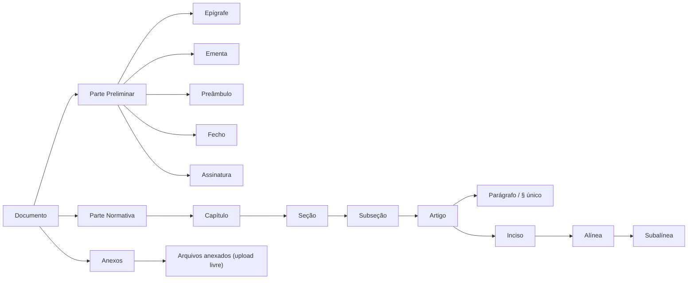

# Modelo de Domínio

O ato normativo é decomposto em três partes, conforme a técnica legislativa:

## Numeração oficial do documento

A identificação de um ato — por exemplo **`ICA 5-3`** — é composta por:

| Componente | Origem | Exemplo |
|---|---|---|
| **Espécie Normativa** | `EspecieNormativaEnum` | `ICA` (Instrução do Comando da Aeronáutica) |
| **Assunto Básico** | `AssuntoBasicoEnum` | `5` (Publicações) |
| **Número Secundário** | Calculado pelo sistema | `3` |

O **número secundário é atribuído automaticamente** pelo `DocumentoService.calculateSecondaryNumber()`: o serviço busca todos os documentos da mesma combinação Espécie + Assunto e **reaproveita a primeira lacuna** na sequência, evitando buracos na numeração do acervo.

O catálogo de espécies inclui DCA, FCA, ICA, MCA, NSCA, OCA, PCA, RCA, RICA, ROCA e TCA — cada uma com nome e descrição normativa completa. Os assuntos básicos cobrem toda a tabela oficial (Doutrina Aeroespacial, Publicações, Tecnologia da Informação, Pessoal, Ensino, Governança, Projetos e demais).

## Numeração automática conforme a técnica legislativa

Segue o **Decreto nº 12.002/2024, art. 9º**:

| Elemento | Formato | Exemplo |
|---|---|---|
| Capítulo / Seção / Subseção | Romano | `CAPÍTULO IV` |
| Artigo | Ordinal até o 9º, cardinal a partir do 10 (com separador de milhar) | `Art. 3º` · `Art. 12.` · `Art. 1.024.` |
| Parágrafo | Ordinal/cardinal com `§` | `§ 1º` · `§ 10.` |
| Parágrafo único | Literal | `Parágrafo único` |
| Inciso | Romano | `VII` |
| Alínea | Letra minúscula | `c)` |
| Subalínea (item) | Arábico | `2.` |
| Artigo incluído por emenda | Sufixo de letra, permanente | `Art. 5-A` |
| Parágrafo incluído por emenda | Sufixo de letra, permanente | `§ 2º-A` |

A renumeração é **recalculada a cada mutação da árvore** — inserir um artigo no meio do documento reordena todos os subsequentes automaticamente, exceto os incluídos por emenda (sufixo de letra, nunca renumerados — ver [Ciclo de emenda](ciclo-de-vida.md#ciclo-de-emenda-alterando-um-ato-ja-publicado)). A mesma proteção vale para parágrafo: o Decreto nº 12.002/2024, art. 14, IV veda expressamente a renumeração de parágrafo já em vigor, então um parágrafo incluído por emenda entre dois já publicados recebe sufixo de letra em vez de deslocar a numeração dos seguintes — o mesmo mecanismo de `Art. 5º-A`, aplicado também a parágrafo.

!!! warning "Duplicação conhecida"
    Esse algoritmo hoje existe **em duas implementações mantidas manualmente em paralelo** — `frontend/src/utils/numbering.js` (preview ao vivo) e a classe interna `Numbering` de `DocumentoFoBuilder.java` (fonte de verdade do PDF). Unificar as duas num único cálculo (servido pelo backend) é uma melhoria listada no [Roadmap](roadmap.md).

Inciso, alínea e subalínea são numerados por contadores posicionais simples entre irmãos do mesmo tipo dentro do mesmo pai — mirrorado entre os métodos privados de `DocumentoFoCorpoBuilder.java` (backend) e a própria travessia de árvore do frontend — e **não** têm a proteção de sufixo de letra que artigo e parágrafo têm: inserir um inciso no meio de um dispositivo já publicado desloca a numeração dos seguintes. O Decreto nº 12.002/2024 não veda isso expressamente para esses níveis (a vedação do art. 14, IV é específica de parágrafo), então essa é uma decisão de escopo deliberada, não um bug.
